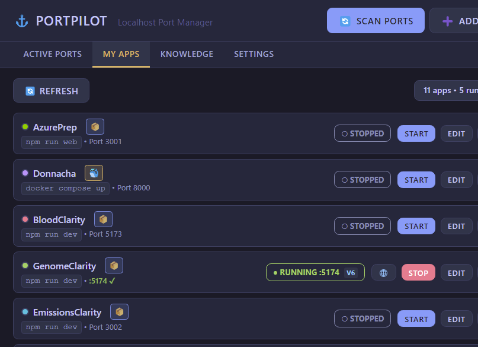
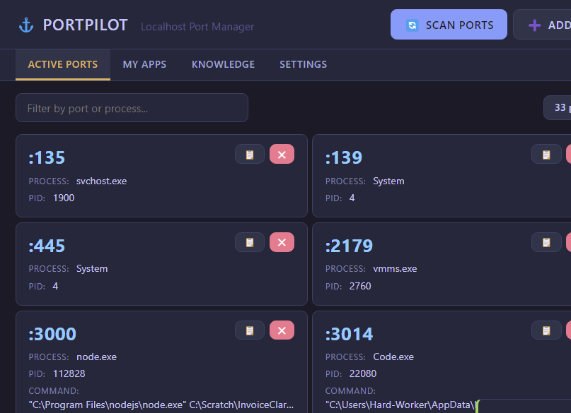
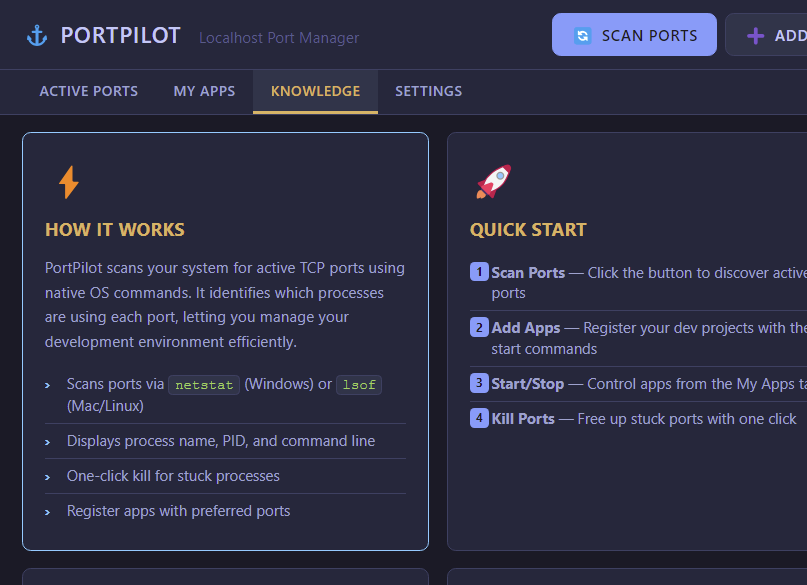
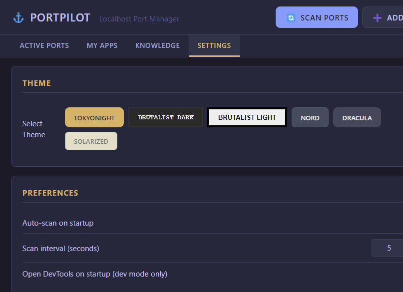
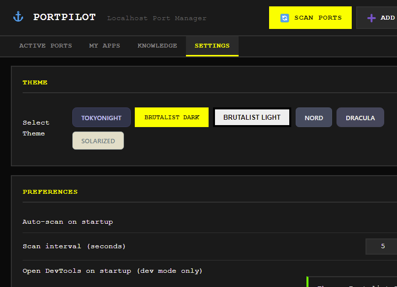

# PortPilot

**Localhost Port Manager** — A desktop app for developers to manage local development ports and applications.

[](https://github.com/m4cd4r4/PortPilot/releases/tag/v1.3.0)
[](TESTING_SUMMARY.md)
[](LICENSE)



## ✨ What's New in v1.3.0

### New Features
- **DevTools Setting** — Toggle DevTools opening on startup (dev mode only)
- **Process Cleanup** — Automatic cleanup after failed starts (no more ghost processes!)
- **Port Conflict Detection** — Pre-flight checks and resolution dialogs
- **Smart Startup Countdown** — Visual feedback when apps are starting
- **App Configuration Editing** — Add/delete apps directly in the UI
- **Refresh Button** — Manual status updates in My Apps tab

### UI/UX Improvements
- **20% Larger Port Numbers** — Easier scanning at a glance
- **Better Spacing** — Increased card padding for better readability
- **2x More Readable Labels** — Improved contrast and visibility
- **Clean Text Truncation** — Ellipsis for long paths instead of awkward breaks
- **Visible Status Badges** — STOPPED badges now clearly visible
- **Prominent App Count** — Easy to see how many apps are running

### Testing
- **100% Test Coverage** — 20/20 tests passing (11 core + 9 feature tests)
- **Screenshot Automation** — `npm run screenshots` for UI documentation
- **Test Infrastructure** — Comprehensive E2E suite with Playwright

[See full changelog →](CHANGELOG.md)

## Features

- **Port Scanner** — Discover all active TCP ports with process details (name, PID, command line)
- **One-Click Kill** — Free up stuck ports instantly
- **App Registry** — Register your dev projects with start commands and preferred ports
- **Process Management** — Start/stop apps directly from PortPilot
- **Auto-Detection** — Automatically detects running apps by matching ports to registered projects
- **Requirement Badges** — Visual indicators for Docker, Node.js, Python, and more
- **Docker Integration** — Click to start Docker Desktop, with status detection
- **IPv4/IPv6 Awareness** — Shows which protocol your app is bound to
- **System Tray** — Minimize to tray, quick access menu
- **Multi-Theme Support** — 6 themes including TokyoNight, Brutalist, Nord, Dracula
- **Knowledge Base** — Built-in help with tips, shortcuts, and common ports reference

## Screenshots

### My Apps
Register and manage your development applications with automatic status detection.


### Active Ports
Scan and view all listening TCP ports with improved readability.



### Knowledge Base
Built-in documentation, shortcuts, and troubleshooting guides.



### Settings
Choose from 6 themes, configure auto-scan, and enable DevTools.



### Dark Theme
Brutalist Dark theme with high contrast and bold design.



## Installation

### Download (Recommended)

**Latest Release: v1.3.0**

- [PortPilot-1.3.0-x64.exe](https://github.com/m4cd4r4/PortPilot/releases/download/v1.3.0/PortPilot-1.3.0-x64.exe) (72 MB) — NSIS Installer
- [PortPilot-1.3.0-portable.exe](https://github.com/m4cd4r4/PortPilot/releases/download/v1.3.0/PortPilot-1.3.0-portable.exe) (72 MB) — Portable Version

### Build from Source

```bash
# Clone the repo
git clone https://github.com/m4cd4r4/PortPilot.git
cd PortPilot

# Install dependencies
npm install

# Run the app
npm start
```

> **Note for VSCode/Claude Code users:** The app automatically clears the `ELECTRON_RUN_AS_NODE` environment variable via `launch.js`.

## Usage

### Scan Ports
Click "Scan Ports" to discover all listening TCP ports. You'll see:
- Port number (large and prominent!)
- Process name
- PID
- Command line (with clean ellipsis for long paths)

Click the ❌ button to kill any process.

### Register Apps
1. Click "Add App"
2. Fill in:
   - **Name**: Display name (e.g., "AzurePrep Frontend")
   - **Command**: Start command (e.g., `npm run dev`)
   - **Working Directory**: Project folder path
   - **Preferred Port**: The port your app should use
   - **Fallback Range**: Alternative ports if preferred is taken (e.g., `3001-3010`)
3. Click "Save App"

Now you can start/stop your apps directly from PortPilot with visual countdown feedback!

## App Badges

PortPilot automatically detects app requirements and shows badges:

| Badge | Meaning | Detected When |
|-------|---------|---------------|
| 🐳 | Docker app | Command includes `docker` or `compose` |
| 📦 | Node.js app | Command includes `npm`, `npx`, `pnpm`, `yarn`, or `bun` |
| 🐍 | Python app | Command includes `python`, `uvicorn`, `flask`, or `django` |
| 🗄️ | Database | Command includes `postgres`, `mysql`, `redis`, or `mongo` |
| ⚡ | Auto-start | App configured to start on launch |
| 🌐 | Remote | App runs on remote server/VPS |

### Docker Integration

- **Yellow pulsing 🐳** — Docker Desktop is not running (click to start)
- **Green 🐳** — Docker Desktop is running and ready

### IPv4/IPv6 Indicators

When apps are running, PortPilot shows `v4` or `v6` to indicate the IP protocol:
- **v4** — Bound to IPv4 (e.g., `0.0.0.0:3000`)
- **v6** — Bound to IPv6 (e.g., `[::]:3000`)

This ensures the browser button opens the correct URL.

## Themes

| Theme | Description |
|-------|-------------|
| **TokyoNight** | Dark blue with cyan/magenta accents (default) |
| **Brutalist Dark** | Pure black, yellow/cyan, monospace |
| **Brutalist Light** | White with black borders, yellow highlights |
| **Nord** | Cool arctic blues |
| **Dracula** | Purple/pink dark theme |
| **Solarized Light** | Warm, easy on the eyes |

## Keyboard Shortcuts

| Shortcut | Action |
|----------|--------|
| `Ctrl+R` | Refresh/Scan ports |
| `Ctrl+N` | Add new app |
| `Ctrl+1` | Ports tab |
| `Ctrl+2` | Apps tab |
| `Ctrl+3` | Knowledge tab |
| `Ctrl+4` | Settings tab |
| `Escape` | Close modal |

## Config Location

Your config is stored at:
- **Windows**: `%APPDATA%/portpilot/portpilot-config.json`
- **macOS**: `~/Library/Application Support/portpilot/portpilot-config.json`
- **Linux**: `~/.config/portpilot/portpilot-config.json`

## Example Config

```json
{
  "apps": [
    {
      "id": "app_azureprep",
      "name": "AzurePrep",
      "command": "npm run web",
      "cwd": "C:\\Scratch\\azure-practice-exam-platform",
      "preferredPort": 3001,
      "fallbackRange": [3002, 3010],
      "color": "#84CC16",
      "autoStart": false
    }
  ],
  "settings": {
    "autoScan": true,
    "scanInterval": 5000,
    "openDevTools": false
  }
}
```

## Development

```bash
# Install dependencies
npm install

# Run in development
npm start

# Run in dev mode (with DevTools if enabled)
npm run dev

# Run all tests
npm run test:all

# Take screenshots
npm run screenshots

# Build installers
npm run build:all
```

## Testing

PortPilot includes a comprehensive Playwright E2E test suite with **100% test coverage**.

```bash
# Run all tests (20 tests)
npm run test:all

# Run core functionality tests (11 tests)
npm test

# Run v1.3.0 feature tests (9 tests)
npm run test:v1.3

# Generate UI screenshots
npm run screenshots
```

**Test Coverage:**
- ✅ UI rendering and navigation (100%)
- ✅ Port scanning functionality (100%)
- ✅ Port filtering (100%)
- ✅ Port killing (100%)
- ✅ Process cleanup (100%)
- ✅ Settings persistence (100%)
- ✅ DevTools toggling (100%)
- ✅ App configuration editing (100%)

**Total: 20/20 tests passing** — See [TESTING_SUMMARY.md](TESTING_SUMMARY.md) for details.

## Tech Stack

- **Electron 27** — Cross-platform desktop framework
- **Node.js** — Process management and port scanning
- **Playwright** — End-to-end testing
- **Vanilla JS** — No framework bloat, lightweight and fast
- **CSS Variables** — Powerful theme system
- **Native Commands** — `netstat` (Windows) / `lsof` (Mac/Linux)

## Version History

### v1.3.0 (2026-01-05) — Current Release
- 7 new features (DevTools, process cleanup, port conflict detection, etc.)
- 7 UI/UX improvements (larger port numbers, better spacing, improved readability)
- 100% test coverage (20/20 tests passing)
- Comprehensive documentation (CHANGELOG.md, TESTING_SUMMARY.md)

### v1.2.0
- Fixed port kill functionality
- Added comprehensive test suite

### v1.1.0
- Initial release with core features
- Multi-theme support
- App registry and management

[Full changelog →](CHANGELOG.md)

## Contributing

Contributions are welcome! Please feel free to submit a Pull Request.

## License

MIT © Macdara

---

**Built with ❤️ for developers who juggle multiple localhost apps**

🚀 [Download Latest Release](https://github.com/m4cd4r4/PortPilot/releases/latest) | 📖 [Documentation](TESTING_SUMMARY.md) | 🐛 [Report Issues](https://github.com/m4cd4r4/PortPilot/issues)
