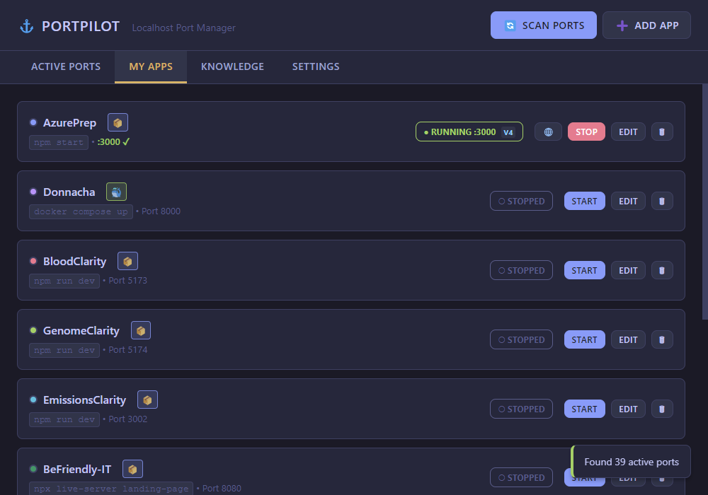
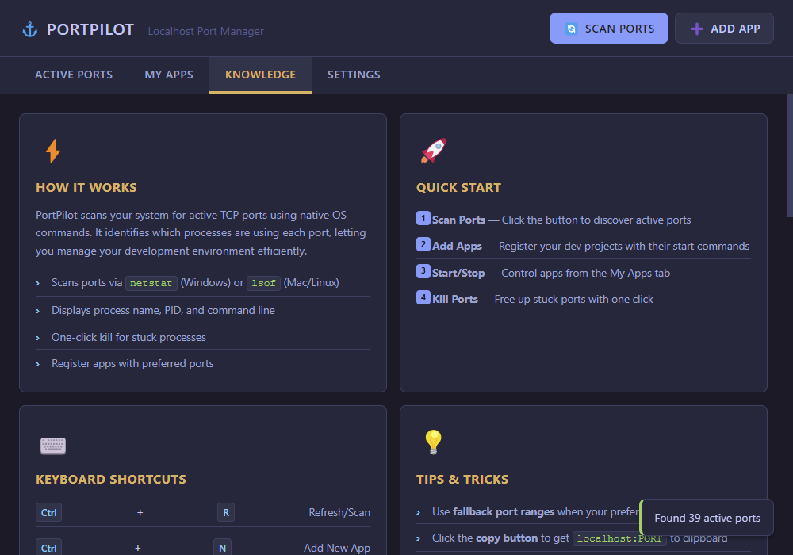
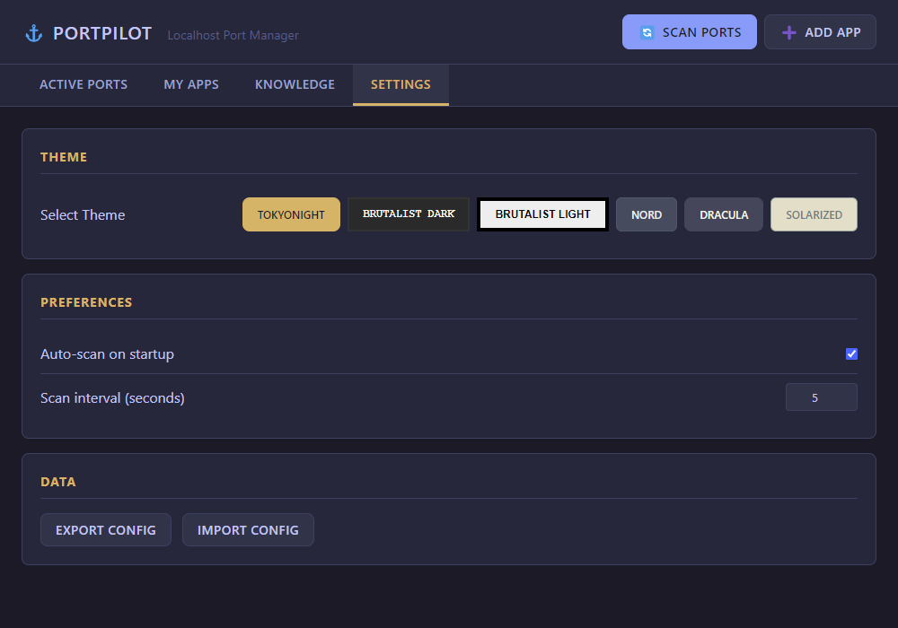

# PortPilot

**Localhost Port Manager** — A desktop app for developers to manage local development ports and applications.



## Features

- **Port Scanner** — Discover all active TCP ports with process details (name, PID, command line)
- **One-Click Kill** — Free up stuck ports instantly
- **App Registry** — Register your dev projects with start commands and preferred ports
- **Process Management** — Start/stop apps directly from PortPilot
- **Auto-Detection** — Automatically detects running apps by matching ports to registered projects
- **Requirement Badges** — Visual indicators for Docker, Node.js, Python, and more
- **Docker Integration** — Click to start Docker Desktop, with status detection
- **IPv4/IPv6 Awareness** — Shows which protocol your app is bound to
- **System Tray** — Minimize to tray, quick access menu
- **Multi-Theme Support** — 6 themes including TokyoNight, Brutalist, Nord, Dracula
- **Knowledge Base** — Built-in help with tips, shortcuts, and common ports reference

## Screenshots

### My Apps
Register and manage your development applications with automatic status detection.


### Active Ports
Scan and view all listening TCP ports on your system.


### Knowledge Base
Built-in documentation, shortcuts, and troubleshooting guides.



### Settings
Choose from 6 themes and configure auto-scan preferences.



## App Badges

PortPilot automatically detects app requirements and shows badges:

| Badge | Meaning | Detected When |
|-------|---------|---------------|
| 🐳 | Docker app | Command includes `docker` or `compose` |
| 📦 | Node.js app | Command includes `npm`, `npx`, `pnpm`, `yarn`, or `bun` |
| 🐍 | Python app | Command includes `python`, `uvicorn`, `flask`, or `django` |
| 🗄️ | Database | Command includes `postgres`, `mysql`, `redis`, or `mongo` |
| ⚡ | Auto-start | App configured to start on launch |
| 🌐 | Remote | App runs on remote server/VPS |

### Docker Integration

- **Yellow pulsing 🐳** — Docker Desktop is not running (click to start)
- **Green 🐳** — Docker Desktop is running and ready

### IPv4/IPv6 Indicators

When apps are running, PortPilot shows `v4` or `v6` to indicate the IP protocol:
- **v4** — Bound to IPv4 (e.g., `0.0.0.0:3000`)
- **v6** — Bound to IPv6 (e.g., `[::]:3000`)

This ensures the browser button opens the correct URL.

## Installation

```bash
# Clone the repo
git clone https://github.com/m4cd4r4/PortPilot.git
cd PortPilot

# Install dependencies
npm install

# Run the app
npm start
```

> **Note for VSCode/Claude Code users:** The app automatically clears the `ELECTRON_RUN_AS_NODE` environment variable via `launch.js`.

## Usage

### Scan Ports
Click "Scan Ports" to discover all listening TCP ports. You'll see:
- Port number
- Process name
- PID
- Command line (Windows)

Click the ❌ button to kill any process.

### Register Apps
1. Click "Add App"
2. Fill in:
   - **Name**: Display name (e.g., "AzurePrep Frontend")
   - **Command**: Start command (e.g., `npm run dev`)
   - **Working Directory**: Project folder path
   - **Preferred Port**: The port your app should use
   - **Fallback Range**: Alternative ports if preferred is taken (e.g., `3001-3010`)
3. Click "Save App"

Now you can start/stop your apps directly from PortPilot.

## Themes

| Theme | Description |
|-------|-------------|
| **TokyoNight** | Dark blue with cyan/magenta accents |
| **Brutalist Dark** | Pure black, yellow/cyan, monospace |
| **Brutalist Light** | White with black borders, yellow highlights |
| **Nord** | Cool arctic blues |
| **Dracula** | Purple/pink dark theme |
| **Solarized Light** | Warm, easy on the eyes |

## Keyboard Shortcuts

| Shortcut | Action |
|----------|--------|
| `Ctrl+R` | Refresh/Scan ports |
| `Ctrl+N` | Add new app |
| `Ctrl+1` | Ports tab |
| `Ctrl+2` | Apps tab |
| `Ctrl+3` | Knowledge tab |
| `Ctrl+4` | Settings tab |
| `Escape` | Close modal |

## Config Location

Your config is stored at:
- **Windows**: `%APPDATA%/portpilot/portpilot-config.json`
- **macOS**: `~/Library/Application Support/portpilot/portpilot-config.json`
- **Linux**: `~/.config/portpilot/portpilot-config.json`

## Example Config

```json
{
  "apps": [
    {
      "id": "app_azureprep",
      "name": "AzurePrep",
      "command": "npm run dev",
      "cwd": "C:\\Scratch\\azure-practice-exam-platform",
      "preferredPort": 5173,
      "fallbackRange": [5174, 5180],
      "color": "#7aa2f7"
    }
  ],
  "settings": {
    "autoScan": true,
    "scanInterval": 5000,
    "theme": "brutalist-dark"
  }
}
```


## Development

```bash
# Install dependencies
npm install

# Run in development
npm start

# Run tests
npm test

# Take screenshots (for docs)
npm run screenshots
```

## Testing

PortPilot includes a comprehensive Playwright test suite:

```bash
# Run automated tests (10/11 passing)
npm test

# Check port status manually
node manual-test-report.js
```

**Test Coverage:**
- ✅ UI rendering and navigation
- ✅ Port scanning functionality
- ✅ Port filtering
- ✅ Test server detection
- ⚠️ Port killing (works manually, dialog automation issue in Playwright)

## Tech Stack

- **Electron 27** — Cross-platform desktop framework
- **Node.js** — Process management and port scanning
- **Playwright** — End-to-end testing
- **Vanilla JS** — No framework bloat
- **CSS Variables** — Theme system
- **Native Commands** — `netstat` (Windows) / `lsof` (Mac/Linux)

## Recent Fixes

- **Port Kill Fix** — Now correctly uses `cmd.exe` shell on Windows (fixed Git Bash compatibility issue)
- **ELECTRON_RUN_AS_NODE** — Automatically cleared via `launch.js` wrapper for VS Code/Claude Code users
- **Cross-Platform** — Works in CMD, PowerShell, Git Bash, and VS Code terminal

## License

MIT
