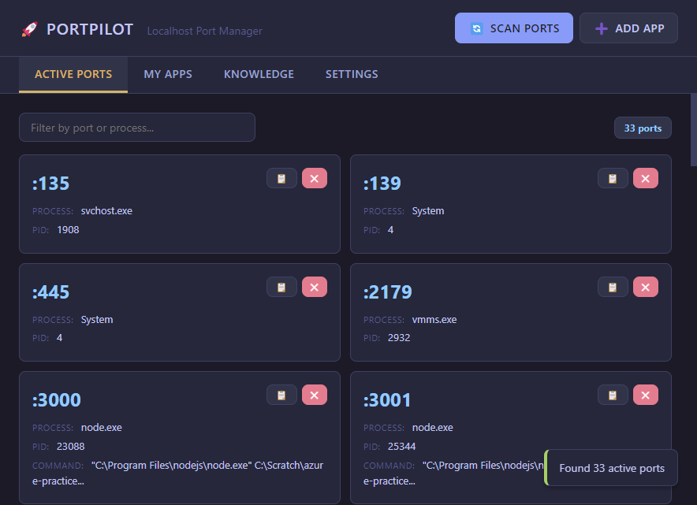
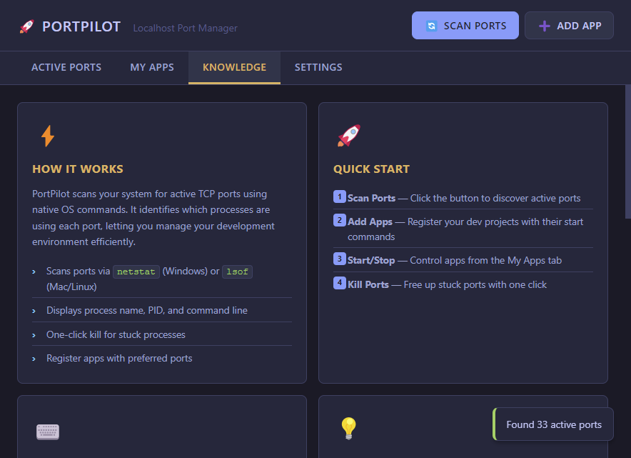
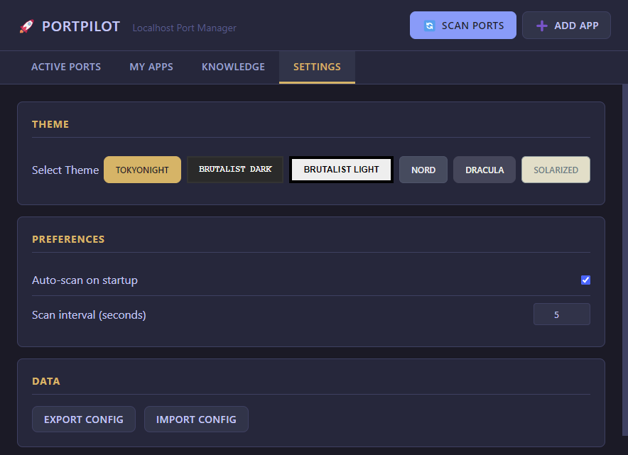

# PortPilot

**Localhost Port Manager** — A desktop app for developers to manage local development ports and applications.



## Features

- **Port Scanner** — Discover all active TCP ports with process details (name, PID, command line)
- **One-Click Kill** — Free up stuck ports instantly
- **App Registry** — Register your dev projects with start commands and preferred ports
- **Process Management** — Start/stop apps directly from PortPilot
- **System Tray** — Minimize to tray, quick access menu
- **Multi-Theme Support** — 6 themes including TokyoNight, Brutalist, Nord, Dracula
- **Knowledge Base** — Built-in help with tips, shortcuts, and common ports reference

## Screenshots

### Active Ports View


### Knowledge Base


### Theme Settings


## Installation

```bash
# Clone the repo
git clone https://github.com/m4cd4r4/PortPilot.git
cd PortPilot

# Install dependencies
npm install

# Run the app
npm start
```

> **Note for VSCode/Claude Code users:** If you get module resolution errors, use `start.bat` which clears the `ELECTRON_RUN_AS_NODE` environment variable.

## Usage

### Scan Ports
Click "Scan Ports" to discover all listening TCP ports. You'll see:
- Port number
- Process name
- PID
- Command line (Windows)

Click the ❌ button to kill any process.

### Register Apps
1. Click "Add App"
2. Fill in:
   - **Name**: Display name (e.g., "AzurePrep Frontend")
   - **Command**: Start command (e.g., `npm run dev`)
   - **Working Directory**: Project folder path
   - **Preferred Port**: The port your app should use
   - **Fallback Range**: Alternative ports if preferred is taken (e.g., `3001-3010`)
3. Click "Save App"

Now you can start/stop your apps directly from PortPilot.

## Themes

| Theme | Description |
|-------|-------------|
| **TokyoNight** | Dark blue with cyan/magenta accents |
| **Brutalist Dark** | Pure black, yellow/cyan, monospace |
| **Brutalist Light** | White with black borders, yellow highlights |
| **Nord** | Cool arctic blues |
| **Dracula** | Purple/pink dark theme |
| **Solarized Light** | Warm, easy on the eyes |

## Keyboard Shortcuts

| Shortcut | Action |
|----------|--------|
| `Ctrl+R` | Refresh/Scan ports |
| `Ctrl+N` | Add new app |
| `Ctrl+1` | Ports tab |
| `Ctrl+2` | Apps tab |
| `Ctrl+3` | Knowledge tab |
| `Ctrl+4` | Settings tab |
| `Escape` | Close modal |

## Config Location

Your config is stored at:
- **Windows**: `%APPDATA%/portpilot/portpilot-config.json`
- **macOS**: `~/Library/Application Support/portpilot/portpilot-config.json`
- **Linux**: `~/.config/portpilot/portpilot-config.json`

## Example Config

```json
{
  "apps": [
    {
      "id": "app_azureprep",
      "name": "AzurePrep",
      "command": "npm run dev",
      "cwd": "C:\\Scratch\\azure-practice-exam-platform",
      "preferredPort": 5173,
      "fallbackRange": [5174, 5180],
      "color": "#7aa2f7"
    }
  ],
  "settings": {
    "autoScan": true,
    "scanInterval": 5000,
    "theme": "brutalist-dark"
  }
}
```

## Development

```bash
# Install dependencies
npm install

# Run in development
npm start

# Take screenshots (for docs)
node screenshot.js
```

## Building for Production

```bash
# Install electron-builder
npm install --save-dev electron-builder

# Add to package.json scripts:
# "dist": "electron-builder"

# Build
npm run dist
```

## Tech Stack

- **Electron 28** — Cross-platform desktop framework
- **Node.js** — Process management and port scanning
- **Vanilla JS** — No framework bloat
- **CSS Variables** — Theme system
- **Native Commands** — `netstat` (Windows) / `lsof` (Mac/Linux)

## License

MIT
