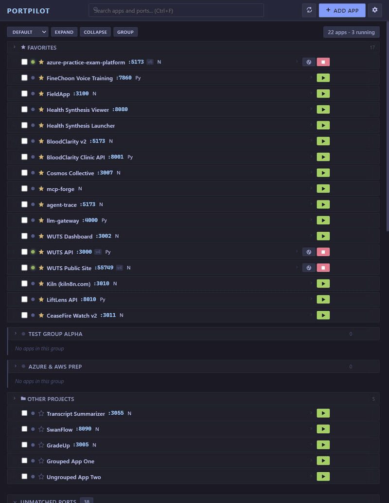

# PortPilot

**Localhost Port Manager for Windows & Linux** — A desktop app for developers to manage local development ports and applications.

**[View Landing Page & Download](https://m4cd4r4.github.io/PortPilot/)**

**[MCP Integration Setup](mcp-server/README.md)**

[](https://github.com/m4cd4r4/PortPilot/releases/tag/v1.6.2)
[](TESTING_SUMMARY.md)
[](LICENSE)
[](mcp-server/README.md)



### ✨ NEW: AI Agent Integration

Control PortPilot with natural language! Works with Claude Code, Cursor, Windsurf, and any MCP-compatible AI assistant.

```
"Start the azure-practice-exam-platform app"
"What's running on port 3001?"
"Kill whatever is running on port 3000"
```

**[→ Setup MCP Integration](mcp-server/README.md)**

## What's New in v1.6.2

### Documentation & UI Cleanup
- **Removed Expand All/Collapse All Buttons** — Commands now show in tooltips, no need for button clutter
- **Comprehensive Auto Detection Documentation** — README now includes detailed docs for all 8 language detectors
- **Table of Contents** — Easy navigation through README sections
- **Updated Landing Page** — Added 4 new language detector badges (Go, .NET, Rust, Ruby)
- **Knowledge Base Updates** — Framework details for new language detectors

### Language Detector Documentation Added
Complete detection criteria, supported frameworks, port detection methods, and confidence scoring for:
- Node.js (React, Next.js, Vue, Angular, Vite, Express, Fastify)
- Python (FastAPI, Django, Flask)
- Docker (docker-compose, Dockerfile)
- **Go** (Gin, Fiber, Echo) ✨
- **.NET** (ASP.NET Core) ✨
- **Rust** (Actix-web, Rocket, Axum, Warp) ✨
- **Ruby** (Rails, Sinatra, Rack) ✨
- Static Sites

## What's New in v1.6.2

### Enhanced Port Cards
- **CMD Icon with Hover Tooltip** — Black CMD badge shows full command path on hover with copy button
- **Single-Row Layout** — Removed second row, CMD tooltip replaces expandable command display
- **Brighter Stats** — Improved visibility of Memory, Uptime, and Connections badges
- **Cleaner Design** — More compact while showing all essential information

### Knowledge Carousel System
- **Horizontal Navigation** — 13 tabs for easy access to all help sections
- **Single Card View** — Clean, focused presentation with smooth transitions
- **v1.6.2 Documentation** — New sections for Port Cards and Port Actions features
- **Enhanced Troubleshooting** — Added FAQs for new features (N/A values, bind indicators)

### App Card Enhancements
- **Folder Button** — 📂 icon opens app's working directory in file explorer
- **Consistent UX** — Matches port card folder button functionality
- **Quick Access** — One-click navigation to project files

### UI Refinements
- **Aligned Keyboard Shortcuts** — Fixed grid layout with centered keys
- **Wider CMD Tooltips** — Increased from 500px to 600px with scrolling support
- **Better Text Wrapping** — Improved long command path display

## What's New in v1.6.0

### Compact & Sharp UI Redesign
- **30-40% More Density** — See more apps and ports on screen without scrolling
- **Sharp 2px Corners** — Modern, clean aesthetic (down from 8px)
- **Tighter Spacing** — Reduced padding and gaps throughout
- **Compact Port Cards** — Process and PID combined on one line for space efficiency
- **Smaller Fonts** — Better information density while maintaining readability

### MCP Auto-Refresh
- **External Changes Detected** — Automatically refreshes when MCP or other tools modify config
- **File Watcher** — Monitors config file for changes with 100ms debounce
- **Toast Notifications** — Visual feedback when apps list updates externally
- **No Restart Required** — Apps added via MCP appear instantly

### Smart Window Auto-Resize
- **Dynamic Height** — Window grows/shrinks based on number of apps
- **Optimal Sizing** — 400px minimum, 1200px maximum
- **Seamless Integration** — Works with MCP auto-refresh
- **Better UX** — No wasted space, no excessive scrolling

### Enhanced Testing
- **100% Test Coverage** — All 11 E2E tests passing
- **Integrated Test Servers** — HTTP servers on ports 3000, 3001, 8080
- **Test Mode Support** — Singleton lock bypass for running tests alongside GUI
- **Improved Reliability** — Fixed visibility issues, better wait strategies

### Bug Fixes
- **ConfigStore Null Reference** — Fixed critical crash on startup
- **Test Infrastructure** — All tests now passing reliably
- **Load Strategy** — Improved app initialization wait logic

[See full changelog →](CHANGELOG-v1.6.0.md)

## What's New in v1.5.0

### Linux Platform Support
- **Cross-Platform Builds** — Now officially supports Windows AND Linux
- **AppImage Package** — Universal Linux binary that runs on any distro (98 MB)
- **.deb Package** — Native Debian/Ubuntu installer (69 MB)
- **WSL Testing** — Full testing support in Windows Subsystem for Linux
- **Platform Auto-Detection** — Automatically adapts commands for Windows/Linux

### System Tray & Window Behaviour
- **Stop All Apps from Tray** — Right-click tray icon to stop all PortPilot-managed apps without quitting
- **Configurable Window Behaviour** — Choose whether close button minimises to tray or exits completely
- **Smart Process Cleanup** — Optionally stop all apps when quitting (only affects PortPilot-managed processes)
- **External Process Safety** — Never touches processes started outside PortPilot

### Single-Instance Lock
- **One Instance Only** — Prevents multiple copies of PortPilot from running simultaneously
- **Smart Window Focusing** — Launching a second instance automatically focuses the existing window
- **No More Confusion** — Single system tray icon, clear state management

[See full changelog →](CHANGELOG.md)


## What's New in v1.4.0

### Browse & Auto-detect Project
- **One-Click Project Setup** — Click "Browse & Auto-detect" in Add App modal to automatically configure any project
- **Recursive Scanning** — Finds projects up to 2 levels deep in subdirectories
- **Package Manager Detection** — Auto-detects pnpm, yarn, or npm and uses the correct command
- **Smart Port Detection** — Only uses explicit port config (no more "everything gets port 3000")
- **Works with Monorepos** — Finds the actual project inside parent folders (e.g., `manual-build/` inside root)

### Port Conflict Warnings
- **Unknown Process Detection** — Warns when unknown processes block your app's preferred port
- **🌐 Preview Button** — Click globe to see what's running on the blocked port
- **Kill Blocker Button** — Terminate blocking processes with one click
- **Toast Notifications** — Visual warnings when port conflicts are detected
- **Improved Matching** — Two-phase algorithm with keyword extraction prevents false positives

### Project Auto-Discovery
- **Automatic Project Detection** — Scan your project directories to automatically discover Node.js, Docker, Python, and static site projects
- **Smart Metadata Extraction** — Automatically detects project names, start commands, and ports
- **User-Configurable Paths** — Add your own scan directories (e.g., `C:\Projects`, `C:\Dev`)
- **Confidence Scoring** — Shows match confidence (95%, 85%, etc.) for each discovered project
- **Bulk Import** — Add all discovered projects at once or pick individual ones
- **Scan Depth Control** — Configure how deep to search (1-5 directory levels)

### Favorites System
- **Star Your Apps** — Click the star (⭐/☆) button to mark frequently-used apps as favorites
- **Organized Sections** — Apps automatically organised into:
  - **⭐ Favorites** — Starred apps at the top for quick access
  - **📁 Other Projects** — Non-starred apps below
- **Collapsible Sections** — Click section headers to expand/collapse
- **Persistent State** — Section collapse state saved across app restarts

### Delete All
- **Bulk Delete** — Remove all apps in one click with "Delete All" button
- **Safety First** — Strong confirmation modal warns before deletion
- **Export Reminder** — Prompts to export config before deleting

[See full changelog →](CHANGELOG.md)

## Features

- **🔍 Browse & Auto-detect** — One-click project setup with recursive scanning and package manager detection
- **⚠️ Port Conflict Warnings** — Visual warnings when unknown processes block app ports, with preview and kill options
- **🔍 Project Auto-Discovery** — Scan directories to automatically find and import dev projects (Node.js, Docker, Python, static sites)
- **⭐ Favorites** — Star frequently-used apps for quick access with collapsible sections
- **🗑 Bulk Operations** — Delete all apps at once with safety confirmations
- **Port Scanner** — Discover all active TCP ports with process details (name, PID, command line)
- **One-Click Kill** — Free up stuck ports instantly
- **App Registry** — Register your dev projects with start commands and preferred ports
- **Process Management** — Start/stop apps directly from PortPilot
- **Smart Port Matching** — Two-phase algorithm with CWD validation and keyword extraction for accurate detection
- **Requirement Badges** — Visual indicators for Docker, Node.js, Python, and more
- **Docker Integration** — Click to start Docker Desktop, with status detection
- **IPv4/IPv6 Awareness** — Shows which protocol your app is bound to
- **System Tray** — Minimize to tray, "Stop All Apps" menu option, configurable window behaviour
- **Single-Instance Lock** — Only one PortPilot runs at a time, focuses existing window
- **Multi-Theme Support** — 6 themes including TokyoNight, Brutalist, Nord, Dracula
- **Knowledge Base** — Built-in help with tips, shortcuts, and common ports reference

## Screenshots

Explore all PortPilot features including My Apps management, Active Ports scanner, Knowledge Base, Settings, multiple themes, and more.


## Installation

### Download (Recommended)

**Latest Release: v1.6.2**

**Windows:**
- [PortPilot-1.6.2-x64.exe](https://github.com/m4cd4r4/PortPilot/releases/download/v1.6.2/PortPilot-1.6.2-x64.exe) — NSIS Installer (72 MB)
- [PortPilot-1.6.2-portable.exe](https://github.com/m4cd4r4/PortPilot/releases/download/v1.6.2/PortPilot-1.6.2-portable.exe) — Portable (72 MB)

**Linux:**
- [PortPilot-1.6.2-x86_64.AppImage](https://github.com/m4cd4r4/PortPilot/releases/download/v1.6.2/PortPilot-1.6.2-x86_64.AppImage) — Universal Linux (98 MB)
- [PortPilot-1.6.2-amd64.deb](https://github.com/m4cd4r4/PortPilot/releases/download/v1.6.2/PortPilot-1.6.2-amd64.deb) — Debian/Ubuntu (69 MB)

**macOS:**
- Build from source (see below) — macOS is supported but not officially tested

### Build from Source

```bash
# Clone the repo
git clone https://github.com/m4cd4r4/PortPilot.git
cd PortPilot

# Install dependencies
npm install

# Run the app
npm start

# Build for your platform
npm run build              # Windows (NSIS installer)
npm run build:linux        # Linux (AppImage + .deb)
npm run build:all-platforms  # Both Windows and Linux
```

> **Note for VSCode/Claude Code users:** The app automatically clears the `ELECTRON_RUN_AS_NODE` environment variable via `launch.js`.

## Usage

### Scan Ports
Click "Scan Ports" to discover all listening TCP ports. You'll see:
- Port number (large and prominent!)
- Process name
- PID
- Command line (with clean ellipsis for long paths)

Click the ❌ button to kill any process.

### Register Apps

#### Option 1: Auto-detect (Recommended)
1. Click "Add App"
2. Click **"🔍 Browse & Auto-detect Project"**
3. Select your project folder (e.g., `C:\Scratch\MyApp`)
4. PortPilot automatically fills in:
   - **Name** from package.json
   - **Command** with the correct package manager (`pnpm run dev`, `yarn dev`, `npm run dev`)
   - **Working Directory** path
   - **Preferred Port** from config files (if found)
5. Review and edit if needed
6. Click "Save App"

#### Option 2: Manual Entry
1. Click "Add App"
2. Fill in:
   - **Name**: Display name (e.g., "AzurePrep Frontend")
   - **Command**: Start command (e.g., `npm run dev`)
   - **Working Directory**: Project folder path
   - **Preferred Port**: The port your app should use (or leave blank to assign later)
   - **Fallback Range**: Alternative ports if preferred is taken (e.g., `3001-3010`)
3. Click "Save App"

Now you can start/stop your apps directly from PortPilot with visual countdown feedback!

### Handle Port Conflicts
When a port is blocked by an unknown process:
1. You'll see **"⚠️ Port Blocked"** status on the app card
2. Click **🌐 Globe button** to preview what's running on that port
3. Click **"Kill Blocker"** to terminate the blocking process
4. Click **"Start"** to launch your app

## App Badges

PortPilot automatically detects app requirements and shows badges:

| Badge | Meaning | Detected When |
|-------|---------|---------------|
| 🐳 | Docker app | Command includes `docker` or `compose` |
| 📦 | Node.js app | Command includes `npm`, `npx`, `pnpm`, `yarn`, or `bun` |
| 🐍 | Python app | Command includes `python`, `uvicorn`, `flask`, or `django` |
| 🗄️ | Database | Command includes `postgres`, `mysql`, `redis`, or `mongo` |
| ⚡ | Auto-start | App configured to start on launch |
| 🌐 | Remote | App runs on remote server/VPS |

### Docker Integration

- **Yellow pulsing 🐳** — Docker Desktop is not running (click to start)
- **Green 🐳** — Docker Desktop is running and ready

### IPv4/IPv6 Indicators

When apps are running, PortPilot shows `v4` or `v6` to indicate the IP protocol:
- **v4** — Bound to IPv4 (e.g., `0.0.0.0:3000`)
- **v6** — Bound to IPv6 (e.g., `[::]:3000`)

This ensures the browser button opens the correct URL.

## Themes

| Theme | Description |
|-------|-------------|
| **TokyoNight** | Dark blue with cyan/magenta accents (default) |
| **Brutalist Dark** | Pure black, yellow/cyan, monospace |
| **Brutalist Light** | White with black borders, yellow highlights |
| **Nord** | Cool arctic blues |
| **Dracula** | Purple/pink dark theme |
| **Solarized Light** | Warm, easy on the eyes |

## Keyboard Shortcuts

| Shortcut | Action |
|----------|--------|
| `Ctrl+R` | Refresh/Scan ports |
| `Ctrl+N` | Add new app |
| `Ctrl+1` | Ports tab |
| `Ctrl+2` | Apps tab |
| `Ctrl+3` | Knowledge tab |
| `Ctrl+4` | Settings tab |
| `Escape` | Close modal |

## Config Location

Your config is stored at:
- **Windows**: `%APPDATA%/portpilot/portpilot-config.json`
- **macOS**: `~/Library/Application Support/portpilot/portpilot-config.json`
- **Linux**: `~/.config/portpilot/portpilot-config.json`

## Example Config

```json
{
  "apps": [
    {
      "id": "app_azureprep",
      "name": "AzurePrep",
      "command": "npm run web",
      "cwd": "C:\\Scratch\\azure-practice-exam-platform",
      "preferredPort": 3001,
      "fallbackRange": [3002, 3010],
      "color": "#84CC16",
      "autoStart": false
    }
  ],
  "settings": {
    "autoScan": true,
    "scanInterval": 5000,
    "openDevTools": false
  }
}
```

## Development

```bash
# Install dependencies
npm install

# Run in development
npm start

# Run in dev mode (with DevTools if enabled)
npm run dev

# Run all tests
npm run test:all

# Take screenshots
npm run screenshots

# Build installers
npm run build:all
```

## Testing

PortPilot includes a comprehensive Playwright E2E test suite with **100% test coverage**.

```bash
# Run all tests (20 tests)
npm run test:all

# Run core functionality tests (11 tests)
npm test

# Run v1.3.0 feature tests (9 tests)
npm run test:v1.3

# Generate UI screenshots
npm run screenshots
```

**Test Coverage:**
- ✅ UI rendering and navigation (100%)
- ✅ Port scanning functionality (100%)
- ✅ Port filtering (100%)
- ✅ Port killing (100%)
- ✅ Process cleanup (100%)
- ✅ Settings persistence (100%)
- ✅ DevTools toggling (100%)
- ✅ App configuration editing (100%)

**Total: 20/20 tests passing** — See [TESTING_SUMMARY.md](TESTING_SUMMARY.md) for details.

## ✨ AI Agent Integration (MCP)

PortPilot includes an MCP (Model Context Protocol) server that lets any compatible AI assistant manage your development environment with natural language.

### Compatible Tools

Works with any MCP-enabled AI assistant:
- **Claude Code** (CLI)
- **Claude Desktop**
- **Cursor**
- **Windsurf**
- **Cline**

### Setup

```bash
# Install MCP server dependencies
cd mcp-server && npm install && cd ..

# Add to Claude Code
claude mcp add portpilot -- node "C:\path\to\PortPilot\mcp-server\index.js"

# Verify connection
claude mcp list
# Should show: portpilot: ... - ✓ Connected
```

**Restart your AI tool** after adding to load the new tools.

### Example Commands

Just ask in natural language:

```
"List all my PortPilot apps"
"Start the azure-practice-exam-platform app"
"What's running on port 3001?"
"Add a new app called 'hero-concepts-preview' at C:\Scratch\azure-practice-exam-platform with command 'npm run web' on port 3001"
"Stop mocksnap"
"Kill whatever is running on port 3000"
"Delete all apps from PortPilot"
"Favorite the AzurePrep app"
```

### Available Tools

| Tool | Description |
|------|-------------|
| `list_apps` | List all registered apps |
| `get_app` | Get details of a specific app |
| `start_app` | Start an app by name or ID |
| `stop_app` | Stop a running app |
| `add_app` | Register a new app |
| `update_app` | Update app configuration |
| `delete_app` | Remove an app |
| `list_running` | Show currently running apps |
| `scan_ports` | Scan for active ports |
| `kill_port` | Kill process on a port |
| `toggle_favorite` | Star/unstar an app |
| `delete_all_apps` | Remove all apps (requires confirmation) |

See [mcp-server/README.md](mcp-server/README.md) for full documentation.

## Tech Stack

- **Electron 27** — Cross-platform desktop framework
- **Node.js** — Process management and port scanning
- **Playwright** — End-to-end testing
- **Vanilla JS** — No framework bloat, lightweight and fast
- **CSS Variables** — Powerful theme system
- **Native Commands** — `netstat` (Windows) / `lsof` (Mac/Linux)

## Version History

### v1.4.0 (2026-01-06) — Current Release
- 🔍 **Browse & Auto-detect** — One-click project setup with recursive scanning
- 📦 **Package Manager Detection** — Auto-detects pnpm, yarn, npm
- ⚠️ **Port Conflict Warnings** — Visual warnings with preview and kill options
- 🔍 **Project Auto-Discovery** — Bulk scan and import projects
- ⭐ **Favorites System** — Star apps for quick access
- 🗑 **Delete All** — Bulk delete with safety confirmations
- ✨ **Improved Port Matching** — Two-phase algorithm with keyword extraction
- ✨ **Smart Port Detection** — No more hard-coded framework defaults

### v1.3.0 (2026-01-05)
- 7 new features (DevTools, process cleanup, port conflict detection, etc.)
- 7 UI/UX improvements (larger port numbers, better spacing, improved readability)
- 100% test coverage (20/20 tests passing)
- Comprehensive documentation (CHANGELOG.md, TESTING_SUMMARY.md)

### v1.2.0
- Fixed port kill functionality
- Added comprehensive test suite

### v1.1.0
- Initial release with core features
- Multi-theme support
- App registry and management

[Full changelog →](CHANGELOG.md)

## Contributing

Contributions are welcome! Please feel free to submit a Pull Request.

## Licence

MIT © Macdara

---

**Built for developers who juggle multiple localhost apps**

🚀 [Download Latest Release](https://github.com/m4cd4r4/PortPilot/releases/latest) | 📖 [Documentation](TESTING_SUMMARY.md) | 🐛 [Report Issues](https://github.com/m4cd4r4/PortPilot/issues)
