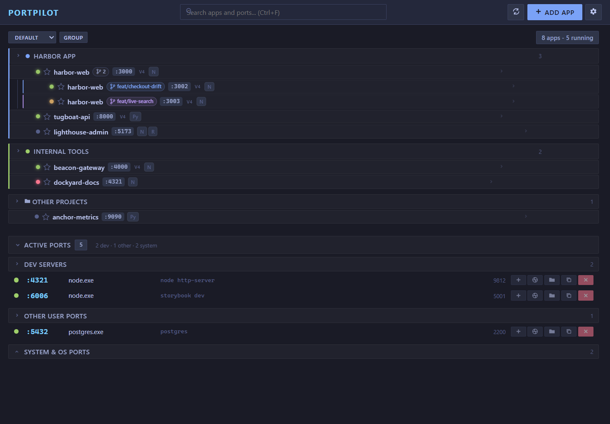
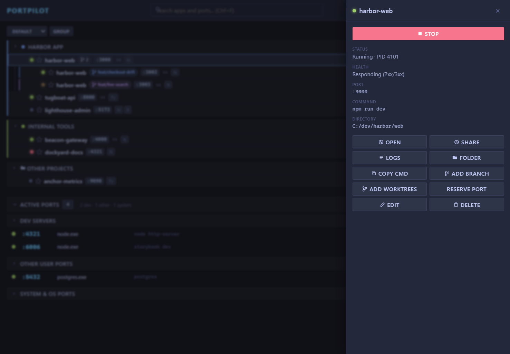
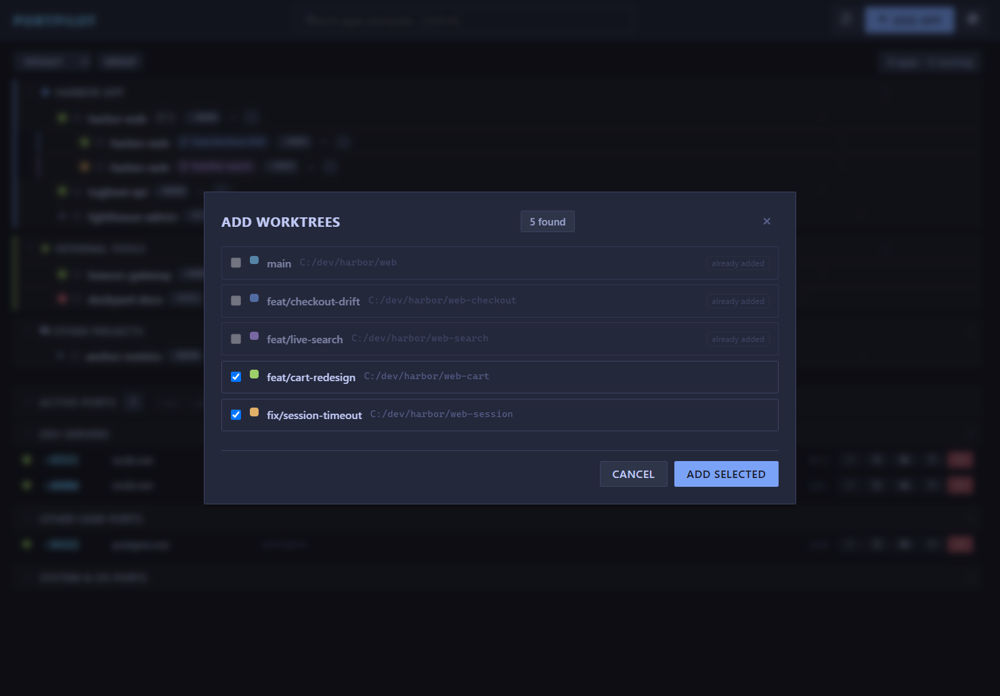

<div align="center">


# ⚓ PortPilot

**Localhost Port Manager for Windows &amp; Linux**

One dashboard for every local dev server across all your projects - including several git branches of the same repo running at once, nested and colour-coded.

*Local-first. No accounts, no telemetry, no cloud. It runs entirely on your machine.*

[](https://github.com/m4cd4r4/PortPilot/releases/tag/v3.3.0)
[](tests/)
[](LICENSE)
[](mcp-server/README.md)
[](https://marketplace.visualstudio.com/items?itemName=macdara.portpilot)

**[View Landing Page &amp; Download](https://m4cd4r4.github.io/PortPilot/)** &nbsp;&middot;&nbsp; **[MCP Integration Setup](mcp-server/README.md)**

</div>



---

## 📑 Table of Contents

- [✨ AI Agent Integration](#-ai-agent-integration)
- [What's New in v3.3.0](#whats-new-in-v330)
- [What's New in v3.2.0](#whats-new-in-v320)
- [What's New in v3.1.0](#whats-new-in-v310)
- [What's New in v3.0.0](#whats-new-in-v300)
- [What's New in v2.0.0](#whats-new-in-v200)
- [What's New in v1.7.0](#whats-new-in-v170)
- [Features](#features)
- [Auto Detection](#auto-detection)
- [Screenshots](#screenshots)
- [Installation](#installation)
- [Usage](#usage)
- [App Badges](#app-badges)
- [Themes](#themes)
- [Keyboard Shortcuts](#keyboard-shortcuts)
- [Testing](#testing)
- [MCP Integration](#-ai-agent-integration-mcp)
- [Tech Stack](#tech-stack)
- [Version History](#version-history)
- [Contributing](#contributing)

---

### ✨ NEW: AI Agent Integration

Control PortPilot with natural language! Works with Claude Code, Cursor, Windsurf, and any MCP-compatible AI assistant.

```
"Start the azure-practice-exam-platform app"
"What's running on port 3001?"
"Kill whatever is running on port 3000"
```

**[→ Setup MCP Integration](mcp-server/README.md)**

## What's New in v3.3.0

### Port Intelligence - PortPilot now manages ports, not just watches them

Registering an app never used to reserve its port, and a running server only told you the port was open, not whether it worked. v3.3.0 closes those gaps.

- **Port reservation** - opt in per app and PortPilot holds a placeholder socket on its port while it's stopped, so nothing else can grab it. The instant you start the app, the reservation is released so the real server binds; on stop or crash it's re-acquired. Toggle it in the detail drawer; reserved apps show an `R` badge.
- **Health checks** - running apps are probed on the loopback address and shown as healthy (2xx/3xx), not responding (an amber pulsing dot on the previously-unused error state), or down. Set a custom health path per app.
- **Conflict resolution** - when an app's preferred port is squatted, resolve it inline: kill the blocker and start, or start on the next free port (without changing the saved port).
- **Framework auto-detect** - Add-App now suggests the conventional dev port for Next, Nuxt, Astro, SvelteKit, Gatsby, Remix, Vite, CRA, Vue and Angular when no explicit port is configured.
- **Stack presets** - Start all / Stop all for a whole group in one click.
- **Crash notifications** - an OS notification + in-app toast when a running app exits unexpectedly (a deliberate stop stays quiet). Toggle in Settings.
- **Share to phone** - copy an app's local or LAN URL, or scan a QR code, to open it on your phone on the same Wi-Fi.

### Themes: a proper Light mode + Auto

A crisp GitHub-style **Light** theme and an **Auto** option that follows your OS light/dark setting and updates live. The dated Brutalist Dark and low-contrast Solarized Light themes were retired (saved preferences migrate automatically).

## What's New in v3.2.0

### Branch & worktree awareness

Run several git branches or worktrees of the same project at once - each on its own port, nested under the parent project and colour-coded to match its VS Code (Peacock) window. No more hand-launching a branch's dev server because it runs on a different port than the configured one.


- **Nested branches** - a worktree/branch shows indented under its main project with a colour rail, branch chip, and a per-parent count, so multiple branches of one repo are visible and runnable simultaneously.
- **Add worktrees** - point PortPilot at a project and it detects the repo's git worktrees (`git worktree list`) and bulk-adds the unregistered ones, reading each one's Peacock colour from `.vscode/settings.json`.
- **Auto-register on mint** - registering a worktree is one MCP call (`add_worktree`) or a headless CLI, so a new-worktree workflow can put each branch into PortPilot automatically.
- **Stale pruning** - if a worktree's folder is removed, its entry is flagged `STALE` with a one-click remove.

### Detail drawer + a calmer, denser UI

Clicking a row opens a slide-over **detail drawer** (full command, working directory, PID, uptime, branch) with Start/Stop, Open, Copy, Add-branch and Remove actions. Rows are denser with hover-revealed actions, and ports and requirements render as quiet chips. The same renderer drives the desktop app and the browser portal, so they look and behave identically.





### VS Code extension parity

The extension's tree views adopt the shared model: branches nest under their project with a colour-coded branch icon, and the Active Ports view groups into Dev Servers / Other User Ports / System & OS (System collapsed), with kill disabled on OS-owned ports.

## What's New in v3.1.0

### Web portal, hosted from VS Code

- Run the web portal **from the VS Code extension** - no desktop app needed. Enable `portpilot.webPortal.enabled` (opt-in, off by default) and the browser UI is available whenever the editor window is open.
- A **"PP Portal"** status-bar item shows it running; click to open `http://127.0.0.1:<port>/`. There are `PortPilot: Start / Stop Web Portal` commands too.
- The extension spawns the same hardened loopback agent (`127.0.0.1`-only, per-session token) using the editor's own Node, and stops it gracefully over an IPC channel - so it works on Windows and the agent does not orphan if the editor closes.
- Optional `portpilot.webPortal.stopAppsOnStop` also stops the dev servers the portal started when you stop the portal.

## What's New in v3.0.0

### Web Agent - PortPilot in your browser

- Run the full UI in a browser with no Electron, via `npm run agent` or the opt-in **Web Access** toggle in Settings
- Embedded in the desktop app it runs in-process, sharing the same config and process table, so apps started in the browser and on the desktop are the same
- Live updates over SSE - external MCP edits push to the browser instantly
- Hardened loopback security: `127.0.0.1`-only, per-session token, Host/Origin allowlists, locked CORS, strict CSP. Full threat model in [SECURITY.md](SECURITY.md)
- Auto-picks a free port if 7317 is taken

### All clients aligned

- The desktop app, MCP server, VS Code extension, and web agent now share one config path and the same **two-phase running detection**, so apps on a dynamic or non-preferred port are detected instead of reading "stopped"
- Dropped the deprecated `wmic` for PowerShell/CIM plus a batched `tasklist` lookup
- Fixed config data loss when editing MCP-added apps, and made `killPort` locale-independent across clients

## What's New in v2.0.0

### Full UI Redesign

- **Single-pane unified layout** - Removed the 4-tab system (Active Ports / My Apps / Knowledge / Settings)
- **Settings moved to a slide-out panel** with backdrop blur
- **Knowledge tab removed** - documentation moved to the GitHub wiki
- **All emoji replaced** with crisp SVG icons (21 inline SVGs)
- **Glassmorphism card design** with backdrop-filter blur
- **New "Glass" theme added** (6 themes total)
- **Global search bar** filters both apps and ports simultaneously
- **App cards show running status inline** (memory, uptime, PID)

### MCP Server v2.0

- Updated from SDK 0.5.0 to 1.29.0 (was broken, now fixed)
- Rewritten with modern McpServer high-level API and Zod schemas
- **6 new tools**: `get_status`, `check_port`, `bulk_start`, `bulk_stop`, `list_groups`, `move_to_group`
- `list_apps` now includes running status inline (no separate call needed)
- **18 total tools** available

### VS Code Extension v1.2.0

- Status bar item showing "PP: N running" with click-to-refresh
- Groups rendered as collapsible tree nodes
- Full CRUD: add, edit, delete apps, change ports, toggle favourites
- Syncs with the Electron app via shared config file

## What's New in v1.7.0

### UX Improvements & International Fix

- **App Search & Filter** - Live search on the My Apps tab filters by name, command, or working directory with 150ms debounce
- **Running Apps Summary** - Header shows a live count badge ("3 running" / "all stopped") at a glance
- **Sort Options** - Sort apps by name A-Z, name Z-A, running status, or port number
- **Group Colours** - Assign a colour to each group; a matching left-border and dot appear on the group header
- **Quick Add Wizard** - 8 pre-built templates (npm dev, Vite, Next.js, Angular, Flask, FastAPI, Docker Compose, Static) pre-fill the add-app form in one click
- **Keyboard Shortcuts** - `Ctrl+F` (focus search), `Ctrl+G` (new group)
- **Rich Tray Menu** - System tray now lists each running app with a one-click Stop button; tooltip shows live app count
- **Bug fix: non-English Windows** - Port scanning now works on all Windows locales (German, French, Spanish, etc.) by checking the foreign-address column instead of matching locale-specific state strings like "ABHÖREN" or "EN ÉCOUTE"

[See full changelog →](CHANGELOG.md)

## Features

### Port Intelligence (v3.3.0)

- **🔒 Port Reservation** - Hold an app's port with a placeholder socket while it's stopped so nothing else takes it; released automatically when the app starts
- **💓 Health Checks** - Loopback probe shows running apps as healthy / not responding / down, with an optional per-app health path
- **🛠 Conflict Resolution** - Kill the blocker and start, or start on the next free port, right from a conflicted row
- **🧭 Framework Auto-detect** - Suggests the conventional dev port for Next, Nuxt, Astro, SvelteKit, Gatsby, Remix, Vite, CRA, Vue, Angular
- **▶️ Stack Presets** - Start all / Stop all for a whole group in one click
- **🔔 Crash Notifications** - OS notification + toast when a running app exits unexpectedly
- **📱 Share to Phone** - Copy an app's local/LAN URL or scan a QR code to open it on your phone

### Everything else

- **🔍 Search & Filter** - Live search on My Apps tab, filter by name/command/cwd
- **⬆️ Sort Options** - Sort apps by name, running status, or port
- **🎨 Group Colours** - Colour-coded groups with left-border accent
- **⚡ Quick Add** - 8 one-click templates for common project types
- **⌨️ Keyboard Shortcuts** - Ctrl+F, Ctrl+G for power users
- **🖥️ Rich Tray Menu** - Running apps listed in tray with per-app Stop buttons
- **🔍 Browse & Auto-detect** - One-click project setup with recursive scanning and package manager detection
- **⚠️ Port Conflict Warnings** - Visual warnings when unknown processes block app ports, with preview and kill options
- **🔍 Project Auto-Discovery** - Scan directories to automatically find and import dev projects (Node.js, Docker, Python, static sites)
- **⭐ Favorites** - Star frequently-used apps for quick access with collapsible sections
- **🗑 Bulk Operations** - Delete all apps at once with safety confirmations
- **Port Scanner** - Discover all active TCP ports with process details (name, PID, command line)
- **One-Click Kill** - Free up stuck ports instantly
- **App Registry** - Register your dev projects with start commands and preferred ports
- **Process Management** - Start/stop apps directly from PortPilot
- **Smart Port Matching** - Two-phase algorithm with CWD validation and keyword extraction for accurate detection
- **Requirement Badges** - Visual indicators for Docker, Node.js, Python, and more
- **Docker Integration** - Click to start Docker Desktop, with status detection
- **IPv4/IPv6 Awareness** - Shows which protocol your app is bound to
- **System Tray** - Minimize to tray, "Stop All Apps" menu option, configurable window behaviour
- **Single-Instance Lock** - Only one PortPilot runs at a time, focuses existing window
- **Multi-Theme Support** - 6 themes plus Auto (follows your OS light/dark): Light, TokyoNight, Nord, Dracula, Glass
- **VS Code Extension** - Status bar counter, collapsible groups, full CRUD from the sidebar
- **Branch & worktree awareness** - run multiple git branches of one project at once, nested and colour-coded; detect a repo's worktrees and bulk-add them; stale entries flagged for removal
- **Detail drawer** - slide-over with full command, cwd, PID, uptime, branch and safe Start/Stop/Open/Copy/Remove actions
- **MCP with 19 tools** - Manage your entire dev environment (including `add_worktree`) via any MCP-compatible AI assistant

## Auto Detection

PortPilot automatically detects 8 different languages and platforms when you use **"🔍 Browse & Auto-detect Project"** or **Project Auto-Discovery**. Detection is intelligent, framework-aware, and includes confidence scoring.

### Supported Languages & Frameworks

#### 📦 Node.js
**Detection Criteria:**
- `package.json` file present
- Package manager files: `package-lock.json`, `yarn.lock`, `pnpm-lock.yaml`, `bun.lockb`

**Supported Frameworks:**
- React, Next.js, Vue, Angular, Vite
- Express, Fastify, Nest.js
- Gatsby, Nuxt, SvelteKit

**Port Detection:**
- Reads `package.json` scripts for port numbers (e.g., `--port 3000`)
- Checks Vite/Next.js config files
- Checks `.env` files for `PORT` variable

**Default Values:**
- Port: 3000
- Command: Auto-detected package manager (`pnpm run dev`, `yarn dev`, `npm run dev`)
- Confidence: 90-95%

---

#### 🐍 Python
**Detection Criteria:**
- `requirements.txt`, `pyproject.toml`, or `Pipfile` present
- Python files with common framework imports

**Supported Frameworks:**
- FastAPI (port 8000)
- Django (port 8000)
- Flask (port 5000)

**Port Detection:**
- Scans Python files for `uvicorn.run()`, `app.run()` with port arguments
- Checks framework-specific config files

**Default Values:**
- Port: 8000 (FastAPI/Django), 5000 (Flask)
- Command: Framework-specific (`uvicorn main:app`, `python manage.py runserver`, `flask run`)
- Confidence: 85-90%

---

#### 🐳 Docker
**Detection Criteria:**
- `docker-compose.yml` or `docker-compose.yaml` present
- `Dockerfile` present

**Port Detection:**
- Parses `docker-compose.yml` for exposed ports
- Reads port mappings (e.g., `3000:3000`, `8080:80`)

**Default Values:**
- Port: Extracted from compose file
- Command: `docker compose up` or `docker-compose up`
- Confidence: 95%

---

#### 🔷 Go
**Detection Criteria:**
- `go.mod` file present
- `main.go` file present

**Supported Frameworks:**
- Gin (port 8080)
- Fiber (port 3000)
- Echo (port 1323)

**Port Detection:**
- Scans `go.mod` for framework dependencies
- Parses `main.go` for port literals (e.g., `:8080`)

**Default Values:**
- Port: 8080 (Gin), 3000 (Fiber), 1323 (Echo)
- Command: `go run .`
- Confidence: 80-95%

---

#### ⚙️ .NET / C#
**Detection Criteria:**
- `.csproj` file present
- `.sln` solution file present

**Supported Frameworks:**
- ASP.NET Core

**Port Detection:**
- Reads `Properties/launchSettings.json` for `applicationUrl`
- Parses port from URLs (e.g., `https://localhost:5001`)

**Default Values:**
- Port: 5000
- Command: `dotnet run`
- Confidence: 85-95%

---

#### 🦀 Rust
**Detection Criteria:**
- `Cargo.toml` file present

**Supported Frameworks:**
- Actix-web (port 8080)
- Rocket (port 8000)
- Axum (port 3000)
- Warp (port 3030)

**Port Detection:**
- Scans `Cargo.toml` dependencies for framework
- Parses `src/main.rs` for `bind()` or `listen()` with port

**Default Values:**
- Port: Framework-specific (see above)
- Command: `cargo run`
- Confidence: 85-95%

---

#### 💎 Ruby
**Detection Criteria:**
- `Gemfile` file present
- `config.ru` file present
- `Rakefile` present

**Supported Frameworks:**
- Ruby on Rails (port 3000)
- Sinatra (port 4567)
- Rack (port 9292)

**Port Detection:**
- Checks for `config/application.rb` (Rails)
- Reads `Gemfile` for framework gems

**Default Values:**
- Port: 3000 (Rails), 4567 (Sinatra), 9292 (Rack)
- Command: `rails server`, `ruby app.rb`, or `rackup`
- Confidence: 70-95%

---

#### 🌐 Static Sites
**Detection Criteria:**
- `index.html` in root directory
- No backend framework files present

**Port Detection:**
- No port needed (serves HTML directly)

**Default Values:**
- Port: N/A
- Command: N/A
- Confidence: 80%

---

### Detection Priority

Detectors run in priority order (highest to lowest):

1. **Docker** (95) - Most explicit configuration
2. **Node.js** (90) - Very common, well-structured
3. **Go** (85)
4. **.NET** (85)
5. **Rust** (85)
6. **Ruby** (85)
7. **Python** (80) - Lower due to less standardized structure
8. **Static Sites** (60) - Fallback for simple projects

If multiple detectors match, the highest-priority one wins.

### Confidence Scoring

| Score | Meaning |
|-------|---------|
| **95%+** | Exact port found in config file |
| **85-94%** | Framework detected, using framework default port |
| **70-84%** | Files detected, using language default port |
| **<70%** | Weak match, manual verification recommended |

## Screenshots

Explore all PortPilot features including app management, the Active Ports scanner, Settings panel, multiple themes, and more.


## Installation

### Download (Recommended)

**Latest Release: v3.3.0**

**Windows:**
- [PortPilot-3.3.0-x64.exe](https://github.com/m4cd4r4/PortPilot/releases/download/v3.3.0/PortPilot-3.3.0-x64.exe) - NSIS Installer (~75 MB)
- [PortPilot-3.3.0-portable.exe](https://github.com/m4cd4r4/PortPilot/releases/download/v3.3.0/PortPilot-3.3.0-portable.exe) - Portable (~75 MB)

**Linux:**
- [PortPilot-3.3.0-x86_64.AppImage](https://github.com/m4cd4r4/PortPilot/releases/download/v3.3.0/PortPilot-3.3.0-x86_64.AppImage) - AppImage (~98 MB)
- [PortPilot-3.3.0-amd64.deb](https://github.com/m4cd4r4/PortPilot/releases/download/v3.3.0/PortPilot-3.3.0-amd64.deb) - Debian/Ubuntu (~69 MB)

**macOS:**
- Build from source (see below) - macOS is supported but not officially tested

### Build from Source

```bash
# Clone the repo
git clone https://github.com/m4cd4r4/PortPilot.git
cd PortPilot

# Install dependencies
npm install

# Run the app
npm start

# Build for your platform
npm run build              # Windows (NSIS installer)
npm run build:linux        # Linux (AppImage + .deb)
npm run build:all-platforms  # Both Windows and Linux
```

> **Note for VSCode/Claude Code users:** The app automatically clears the `ELECTRON_RUN_AS_NODE` environment variable via `launch.js`.

## Usage

### Scan Ports
Click "Scan Ports" to discover all listening TCP ports. You'll see:
- Port number (large and prominent!)
- Process name
- PID
- Command line (with clean ellipsis for long paths)

Click the ❌ button to kill any process.

### Register Apps

#### Option 1: Auto-detect (Recommended)
1. Click "Add App"
2. Click **"🔍 Browse & Auto-detect Project"**
3. Select your project folder (e.g., `C:\Scratch\MyApp`)
4. PortPilot automatically fills in:
   - **Name** from package.json
   - **Command** with the correct package manager (`pnpm run dev`, `yarn dev`, `npm run dev`)
   - **Working Directory** path
   - **Preferred Port** from config files (if found)
5. Review and edit if needed
6. Click "Save App"

#### Option 2: Manual Entry
1. Click "Add App"
2. Fill in:
   - **Name**: Display name (e.g., "AzurePrep Frontend")
   - **Command**: Start command (e.g., `npm run dev`)
   - **Working Directory**: Project folder path
   - **Preferred Port**: The port your app should use (or leave blank to assign later)
   - **Fallback Range**: Alternative ports if preferred is taken (e.g., `3001-3010`)
3. Click "Save App"

Now you can start/stop your apps directly from PortPilot with visual countdown feedback!

### Handle Port Conflicts
When a port is blocked by an unknown process:
1. You'll see **"⚠️ Port Blocked"** status on the app card
2. Click **🌐 Globe button** to preview what's running on that port
3. Click **"Kill Blocker"** to terminate the blocking process
4. Click **"Start"** to launch your app

## App Badges

PortPilot automatically detects app requirements and shows badges:

| Badge | Meaning | Detected When |
|-------|---------|---------------|
| 🐳 | Docker app | Command includes `docker` or `compose` |
| 📦 | Node.js app | Command includes `npm`, `npx`, `pnpm`, `yarn`, or `bun` |
| 🐍 | Python app | Command includes `python`, `uvicorn`, `flask`, or `django` |
| 🗄️ | Database | Command includes `postgres`, `mysql`, `redis`, or `mongo` |
| ⚡ | Auto-start | App configured to start on launch |
| 🌐 | Remote | App runs on remote server/VPS |

### Docker Integration

- **Yellow pulsing 🐳** - Docker Desktop is not running (click to start)
- **Green 🐳** - Docker Desktop is running and ready

### IPv4/IPv6 Indicators

When apps are running, PortPilot shows `v4` or `v6` to indicate the IP protocol:
- **v4** - Bound to IPv4 (e.g., `0.0.0.0:3000`)
- **v6** - Bound to IPv6 (e.g., `[::]:3000`)

This ensures the browser button opens the correct URL.

## Themes

| Theme | Description |
|-------|-------------|
| **Auto** | Follows your OS light/dark setting (Light or TokyoNight), updates live |
| **Light** | Crisp GitHub-style neutral - white surfaces, high-contrast text |
| **TokyoNight** | Dark blue with cyan/magenta accents (default) |
| **Nord** | Cool arctic blues |
| **Dracula** | Purple/pink dark theme |
| **Glass** | Translucent glassmorphism with extra transparency |

## Keyboard Shortcuts

| Shortcut | Action |
|----------|--------|
| `Ctrl+R` | Refresh/Scan ports |
| `Ctrl+N` | Add new app |
| `Ctrl+F` | Focus global search |
| `Ctrl+G` | New group |
| `Escape` | Close modal / Settings panel |

## Config Location

Your config is stored at:
- **Windows**: `%APPDATA%/portpilot/portpilot-config.json`
- **macOS**: `~/Library/Application Support/portpilot/portpilot-config.json`
- **Linux**: `~/.config/portpilot/portpilot-config.json`

## Example Config

```json
{
  "apps": [
    {
      "id": "app_azureprep",
      "name": "AzurePrep",
      "command": "npm run web",
      "cwd": "C:\\Scratch\\azure-practice-exam-platform",
      "preferredPort": 3001,
      "fallbackRange": [3002, 3010],
      "color": "#84CC16",
      "autoStart": false
    }
  ],
  "settings": {
    "autoScan": true,
    "scanInterval": 5000,
    "openDevTools": false
  }
}
```

## Development

```bash
# Install dependencies
npm install

# Run in development
npm start

# Run in dev mode (with DevTools if enabled)
npm run dev

# Run all tests
npm run test:all

# Take screenshots
npm run screenshots

# Build installers
npm run build:all
```

## Testing

PortPilot uses a Playwright end-to-end smoke suite that drives the real Electron app.

```bash
# Run the E2E smoke suite (launches Electron + test servers on 3000/3001/8080)
npm test

# On headless Linux, run under a virtual display
xvfb-run -a npm test

# Generate UI screenshots
npm run screenshots
```

**Covered:** window launch, port scanning, test-server detection, port-card rendering,
global search filtering, copy/kill controls, the Settings panel, and the Add App modal.

> The older `v1.3`/`v1.7`/`groups` feature specs targeted the pre-v2.0 tab UI and are
> kept for reference only; they need rewriting against the single-pane layout before
> being re-enabled in `test:all`.

## ✨ AI Agent Integration (MCP)

PortPilot includes an MCP (Model Context Protocol) server that lets any compatible AI assistant manage your development environment with natural language.

### Compatible Tools

Works with any MCP-enabled AI assistant:
- **Claude Code** (CLI)
- **Claude Desktop**
- **Cursor**
- **Windsurf**
- **Cline**

### Setup

```bash
# Install MCP server dependencies
cd mcp-server && npm install && cd ..

# Add to Claude Code
claude mcp add portpilot -- node "C:\path\to\PortPilot\mcp-server\index.js"

# Verify connection
claude mcp list
# Should show: portpilot: ... - ✓ Connected
```

**Restart your AI tool** after adding to load the new tools.

### Example Commands

Just ask in natural language:

```
"List all my PortPilot apps"
"Start the azure-practice-exam-platform app"
"What's running on port 3001?"
"Add a new app called 'hero-concepts-preview' at C:\Scratch\azure-practice-exam-platform with command 'npm run web' on port 3001"
"Stop mocksnap"
"Kill whatever is running on port 3000"
"Delete all apps from PortPilot"
"Favorite the AzurePrep app"
```

### Available Tools

| Tool | Description |
|------|-------------|
| `list_apps` | List all registered apps with running status inline |
| `get_app` | Get details of a specific app |
| `get_status` | Get overall PortPilot status summary |
| `start_app` | Start an app by name or ID |
| `stop_app` | Stop a running app |
| `bulk_start` | Start multiple apps at once |
| `bulk_stop` | Stop multiple apps at once |
| `add_app` | Register a new app |
| `add_worktree` | Register a git worktree/branch nested under its parent project (auto-detects branch + parent from git) |
| `update_app` | Update app configuration |
| `delete_app` | Remove an app |
| `list_running` | Show currently running apps |
| `scan_ports` | Scan for active ports |
| `check_port` | Check what is running on a specific port |
| `kill_port` | Kill process on a port |
| `toggle_favorite` | Star/unstar an app |
| `delete_all_apps` | Remove all apps (requires confirmation) |
| `list_groups` | List all app groups |
| `move_to_group` | Move an app to a different group |

See [mcp-server/README.md](mcp-server/README.md) for full documentation.

## Web Agent (v3 preview)

PortPilot can also run as a **local web app** — the same UI in your browser,
backed by a hardened loopback agent. This is an experimental preview.

```bash
npm run agent
# →  http://127.0.0.1:7317/
```

The agent runs the same backend as the desktop app and reuses the same UI, so
you get PortPilot in a browser tab without Electron. Because the backend can
start/kill processes, it is locked down with several independent controls:

- Binds to **`127.0.0.1` only** (never reachable off your machine)
- A **per-session token** is required on every API call
- **Host-header** validation (defeats DNS-rebinding) and **Origin/CORS** lockdown
- A custom header forces a **CORS preflight**, blocking cross-site requests
- Strict **CSP**; token file written `chmod 600`

See **[SECURITY.md](SECURITY.md)** for the full threat model and verified
behaviour. Run **either** the desktop app or the agent at a time (they track
started processes separately).

## Tech Stack

- **Electron 27** - Cross-platform desktop framework
- **Node.js** - Process management and port scanning
- **Playwright** - End-to-end testing
- **Vanilla JS** - No framework bloat, lightweight and fast
- **CSS Variables** - Powerful theme system
- **Native Commands** - `netstat` (Windows) / `lsof` (Mac/Linux)

## Version History

### v3.3.0 (2026-07-01) - Current Release
- Port Intelligence: PortPilot now actively manages ports rather than only observing them
- Port reservation - hold an app's port with a placeholder socket while it's stopped; released on start, re-acquired on stop/crash
- Health checks - loopback liveness probe (healthy / not responding / down) with an optional per-app health path
- Conflict resolution - kill the blocker and start, or start on the next free port, from a conflicted row
- Framework auto-detect - suggests the conventional dev port for Next/Nuxt/Astro/SvelteKit/Gatsby/Remix/Vite/CRA/Vue/Angular
- Stack presets - Start all / Stop all per group; crash notifications (OS + toast); Share to phone (local/LAN URL + QR)
- Themes - new crisp Light mode and an Auto option that follows the OS; retired Brutalist Dark and Solarized Light

### v3.2.0 (2026-07-01)
- Branch & worktree awareness - run multiple git branches of one project at once, each on its own port, nested under the parent and colour-coded to match its VS Code (Peacock) window
- "Add worktrees" auto-detects a repo's git worktrees and bulk-adds them; `add_worktree` MCP tool + CLI register a worktree under its parent (19 MCP tools total)
- Detail drawer on row click (command, cwd, PID, uptime, branch; Start/Stop/Open/Copy/Remove); denser rows with hover-revealed actions; ports and requirements as chips
- Stale-worktree pruning - a branch whose folder is gone is flagged and one-click removable
- VS Code extension parity - branches nest in the tree; Active Ports grouped Dev/Other/System with kill gated off system ports

### v3.1.0 (2026-06-08)
- Web portal hosted from VS Code - the extension runs the browser UI itself (opt-in `portpilot.webPortal.enabled`), no desktop app needed
- Spawns the hardened loopback agent with the editor's own Node; "PP Portal" status-bar item; graceful IPC shutdown (works on Windows); self-exits if the editor host closes
- Opt-in `portpilot.webPortal.stopAppsOnStop` to also stop the dev servers the portal started

### v3.0.0 (2026-06-08)
- Web Agent - run PortPilot in the browser (`npm run agent` or the in-app Web Access toggle), shared in-process with the desktop app
- SSE live updates, auto-port-fallback, and a hardened loopback security model (token, Host/Origin allowlists, locked CORS, strict CSP) - see SECURITY.md
- All clients aligned on one config path and the same two-phase running detection (apps on dynamic ports now detected)
- Dropped deprecated wmic for PowerShell/CIM + tasklist; locale-independent killPort across clients
- Fixed config data loss on MCP-added apps; VS Code extension now matches the desktop app's running detection
- App log viewer (desktop), opt-in window auto-resize, app-card accessibility

### v2.0.0 (2026-04-14)
- Full UI redesign - single-pane layout replaces 4-tab system
- Settings moved to slide-out panel with backdrop blur
- Knowledge tab removed (docs moved to GitHub wiki)
- 21 inline SVG icons replace all emoji
- Glassmorphism card design with backdrop-filter blur
- New Glass theme (6 themes total)
- Global search bar filters apps and ports simultaneously
- MCP Server v2.0 - rewritten with McpServer API and Zod schemas on SDK 1.29.0
- 6 new MCP tools (18 total): get_status, check_port, bulk_start, bulk_stop, list_groups, move_to_group
- VS Code Extension v1.2.0 - status bar, collapsible groups, full CRUD

### v1.7.0 (2026-03-25)
- App search and filter on My Apps tab
- Running apps summary badge in header
- Sort options (name, status, port)
- Group colour picker with left-border accent
- Quick Add wizard with 8 project templates
- Rich tray menu with per-app Stop buttons
- Bug fix: locale-independent port scanning (non-English Windows)

[Full changelog →](CHANGELOG.md)

## Contributing

Contributions are welcome! Please feel free to submit a Pull Request.

## Licence

MIT © Macdara

---

**Built for developers who juggle multiple localhost apps**

🚀 [Download Latest Release](https://github.com/m4cd4r4/PortPilot/releases/latest) | 📖 [Documentation](TESTING_SUMMARY.md) | 🐛 [Report Issues](https://github.com/m4cd4r4/PortPilot/issues)
