<div align="center">

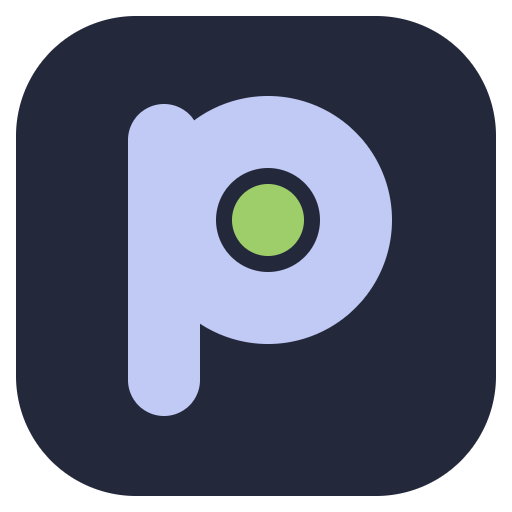

# PortPilot

**You and Claude Code, one view of what's running.**

PortPilot runs your local dev servers. With the Claude Code plugin, Claude sees the same apps, ports and crashes you do, and reuses a running server instead of starting a second copy.

[](https://github.com/m4cd4r4/PortPilot/releases/tag/v3.5.0)
[](tests/)
[](LICENSE)
[](mcp-server/README.md)
[](https://marketplace.visualstudio.com/items?itemName=macdara.portpilot)

**[Download v3.5.0](#install)** &nbsp;&middot;&nbsp; **[Add the Claude Code plugin](#use-it-with-claude-code)** &nbsp;&middot;&nbsp; **[Website](https://m4cd4r4.github.io/PortPilot/)**

</div>

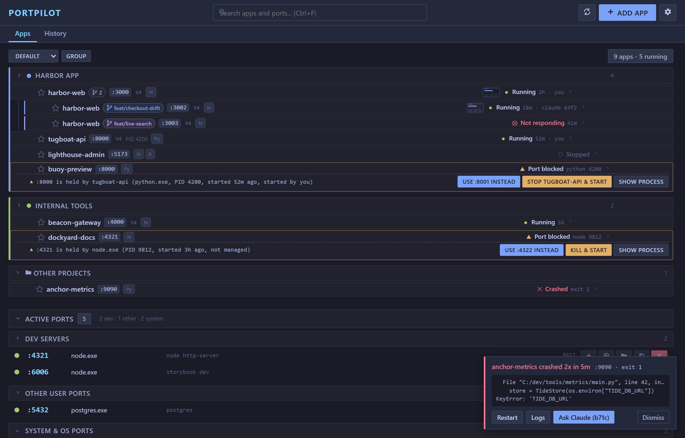

Local-first: no account, no telemetry, no cloud. Windows 10/11 and Linux.

## Ways to use PortPilot

Four surfaces, one config file and one run record. An app you add in one shows up in the others, and a start or crash in one is visible in all of them.

**Desktop app.** The full view: apps, ports, conflicts, crashes and the History tab. Pick it when you want everything on one screen, or a tray icon that keeps your servers alive after you close the window.

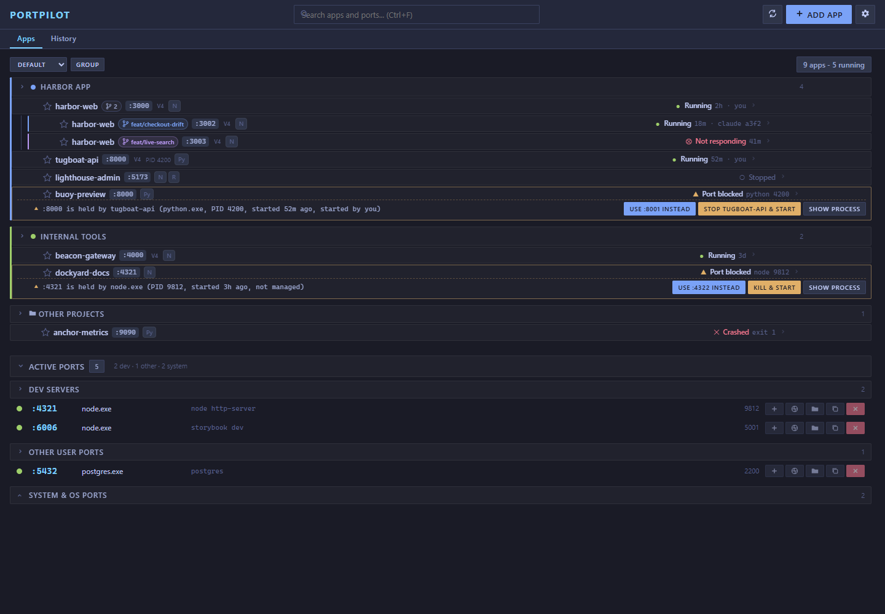

**Web portal.** The same Apps view in your browser, from `npm run agent` or from VS Code. It binds `127.0.0.1` only and needs a per-session token. Pick it on a machine where you cannot install the desktop app. The History tab and crash toasts are not in the portal yet.

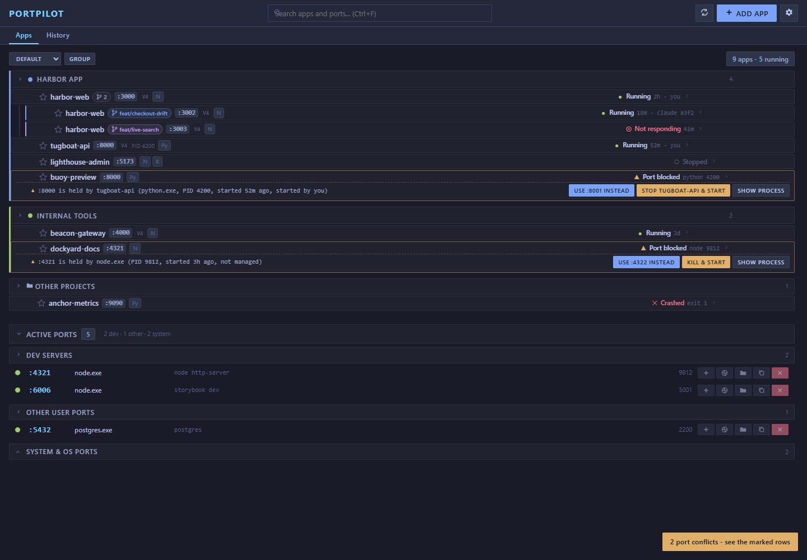

**VS Code extension.** The sidebar tree, a status bar item and a crash toast, without leaving the editor. Running apps come first, stopped ones fold away, and a ✦ marks anything Claude started. Pick it if you live in VS Code.

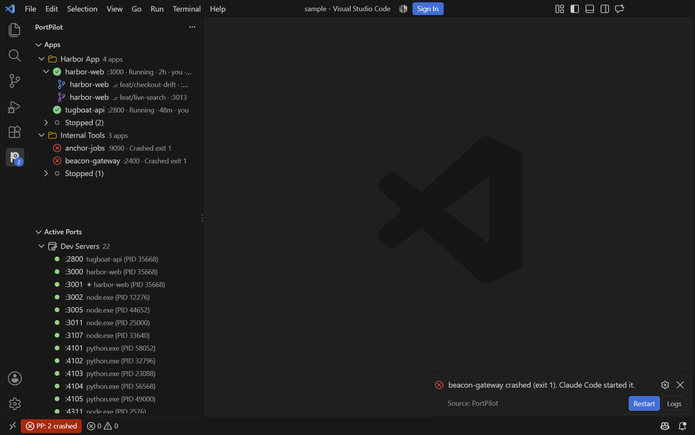

**Claude Code.** Install the plugin and Claude sees what you see: a status line, a guard that points a second start at the running server, a crash band with Fix it, and the 20 MCP tools such as `find_run`. Pick it when Claude is the one starting your servers.

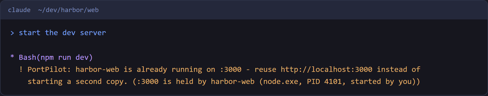

<details>
<summary><b>More Claude Code views</b></summary>

Status line, worst state first, ✦ on apps Claude started:

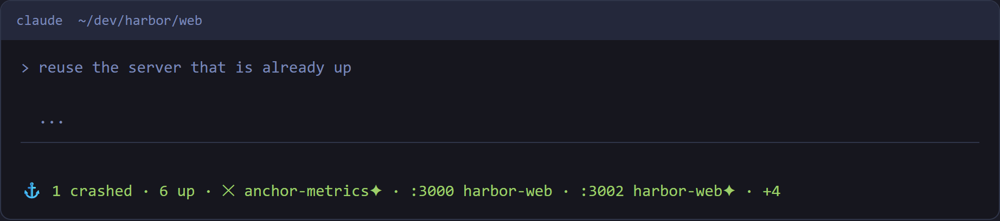

Crash band with Fix it, Restart, Logs and Dismiss:

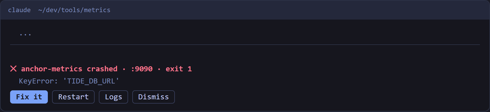

`find_run` bringing back a past version of a page, with the literal steps:

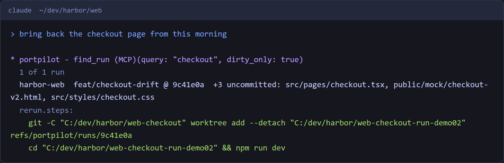

The Claude Code images are terminal frames rendered around the plugin's real output on the demo data, not captures of the Claude Code app.

</details>

Refresh every image here with `docs/demo/tools/` (`desktop-shots.mjs`, `web-shot.mjs`, `claude-shots.mjs`, `history-shot.mjs`); the demo data is fictional.

## Use it with Claude Code

```text
/plugin marketplace add m4cd4r4/PortPilot
/plugin install portpilot@portpilot
```

The MCP server is bundled, so there is no `npm install`. One install gives Claude:

- **Status line.** Every session shows what is up, worst state first. A ✦ marks apps Claude started.
  ```text
  ⚓ 1 crashed · 6 up · :3000 harbor-web
  ```
- **Dev-server guard.** A start on a busy port is turned away with the URL to reuse. A clean start goes through PortPilot. If the guard can't tell what a command does, it lets it run.
- **Crash band with Fix it.** When an app Claude started crashes, the session gets a band with Restart, Logs and Fix it. Fix it hands Claude the crash and the stderr tail.
- **The PortPilot tools**: list, start, stop, scan, kill and group, as the 20 [MCP tools](#mcp-tools).

## New in the desktop app (3.4 and 3.5)

Each row now tells you what is happening and who did it.

**Row state, and who started it.** Every app shows its state, how long it has been in it and who started it: you, or a Claude Code session. A crashed app reads `✕ Crashed · exit 1`. The VS Code tree uses the same states.

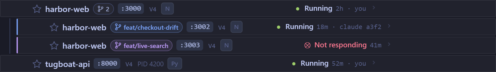

**Conflict strip.** When something else holds an app's port, the row says what holds it and offers Use free port, Kill & start or Show process. Kill asks for a second click.

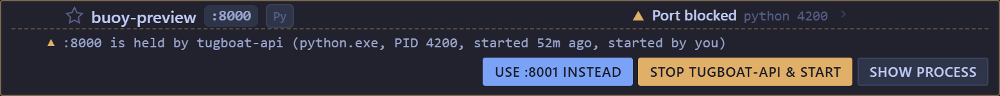

**Crash toast with Ask Claude.** A crash raises a sticky toast with the stderr tail. Ask Claude appears when the session that started the app is still open, and sends it the crash. Repeat crashes group into one toast.

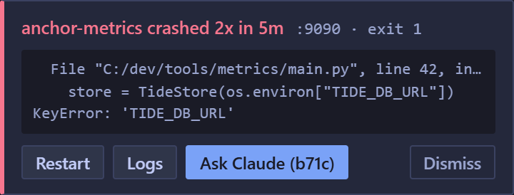

**History tab.** Every run is recorded with the git state it ran from, including uncommitted changes. Search by app, branch, file or SHA, open the page a run served while it is still up, copy its SHA, or pin it so it is never pruned. **Re-run this version** puts that exact commit and its uncommitted files in a new sibling worktree, installs from the lockfile and starts it on a free port. Claude finds the same runs with `find_run`.

Running apps on the Apps tab show a small preview of the page they serve, beside the state. It is the thumbnail the History tab already holds, so no extra capture runs; switch it off under Settings.

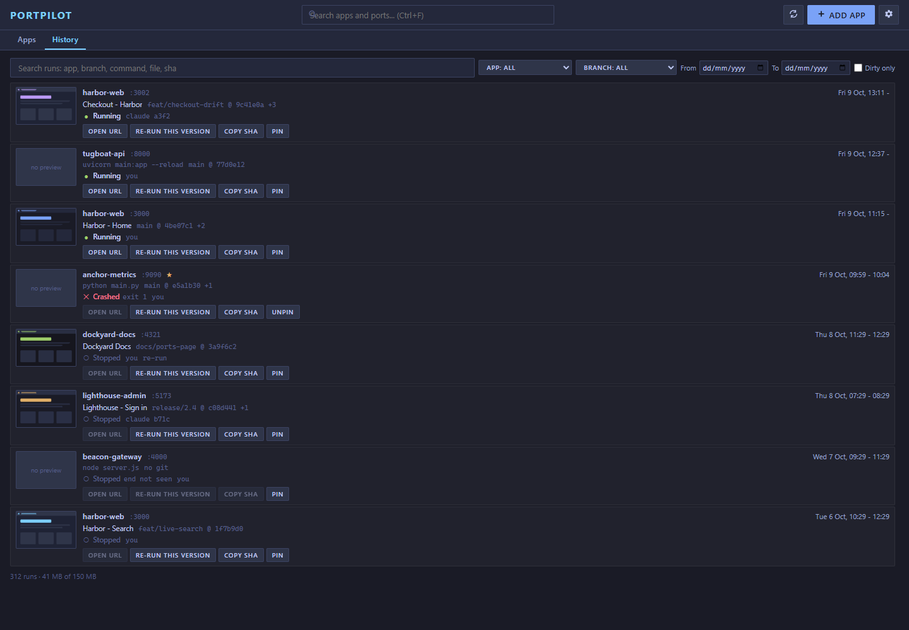

## Any MCP assistant

The PortPilot MCP server works with Claude Code, Claude Desktop, Cursor, Windsurf, Cline and any other MCP client. Ask in plain language:

```text
"What's running on :3000?"
"Start tugboat-api"
"Kill whatever is on port 8000"
"Start all my favourites"
```

Setup outside the plugin: [mcp-server/README.md](mcp-server/README.md).

<details id="mcp-tools">
<summary><b>MCP tools (20)</b></summary>

| Tool | Description |
|------|-------------|
| `list_apps` | List all registered apps with running status inline |
| `get_app` | Get details of a specific app |
| `get_status` | Get overall PortPilot status summary |
| `start_app` | Start an app by name or ID |
| `stop_app` | Stop a running app |
| `bulk_start` | Start multiple apps at once |
| `bulk_stop` | Stop multiple apps at once |
| `add_app` | Register a new app |
| `add_worktree` | Register a git worktree/branch nested under its parent project (auto-detects branch + parent from git) |
| `update_app` | Update app configuration |
| `delete_app` | Remove an app |
| `list_running` | Show currently running apps |
| `scan_ports` | Scan for active ports |
| `check_port` | Check what is running on a specific port |
| `kill_port` | Kill process on a port |
| `toggle_favorite` | Star/unstar an app |
| `delete_all_apps` | Remove all apps (requires confirmation) |
| `list_groups` | List all app groups |
| `move_to_group` | Move an app to a different group |
| `find_run` | Find a past run by text, app, branch or time; returns its git state and literal re-run steps |

Manual setup for Claude Code without the plugin:

```bash
cd mcp-server && npm install && cd ..
claude mcp add portpilot -- node "/path/to/PortPilot/mcp-server/index.js"
claude mcp list   # portpilot: ... - ✓ Connected
```

</details>

## Everything else it does

**Run and organise**
- Start and stop apps with port detection and fallback ranges
- Groups with colours, favourites, search and sort
- Branches and worktrees nest under their project, colour-matched to VS Code (Peacock)
- Detail drawer: command, folder, PID, uptime
- Port reservation, health checks and Start all / Stop all per group

**Ports**
- Scan every TCP port with process, PID, memory and uptime
- Kill a stuck port in one click
- Grouped into Dev, Other and System
- Bind type and IPv4/IPv6 on each port

**Auto-detect**
- Point it at a folder to find Node.js, Python, Go, .NET, Rust, Ruby and Docker projects ([how detection works](docs/AUTO-DETECTION.md))
- Add a repo's worktrees in one go; stale ones are flagged
- Docker status badges, and Docker Desktop in one click

**Everywhere**
- [VS Code extension](https://marketplace.visualstudio.com/items?itemName=macdara.portpilot): sidebar tree and status bar
- Web portal in your browser, loopback-only (see [Web agent](#web-agent))
- Tray menu with a Stop per running app
- 6 themes plus Auto: Light, TokyoNight, Nord, Dracula, Glass
- Share an app's LAN URL to your phone by QR code

## Install

| Platform | Download |
|----------|----------|
| Windows installer | [PortPilot-3.5.0-x64.exe](https://github.com/m4cd4r4/PortPilot/releases/download/v3.5.0/PortPilot-3.5.0-x64.exe) (113 MB) |
| Windows portable | [PortPilot-3.5.0-portable.exe](https://github.com/m4cd4r4/PortPilot/releases/download/v3.5.0/PortPilot-3.5.0-portable.exe) (113 MB) |
| Linux AppImage | [PortPilot-3.5.0-x86_64.AppImage](https://github.com/m4cd4r4/PortPilot/releases/download/v3.5.0/PortPilot-3.5.0-x86_64.AppImage) (123 MB) |
| Debian / Ubuntu | [PortPilot-3.5.0-amd64.deb](https://github.com/m4cd4r4/PortPilot/releases/download/v3.5.0/PortPilot-3.5.0-amd64.deb) (86 MB) |

macOS: build from source; it is supported but not officially tested. Install it, click Scan, then add your projects. Older builds are on [Releases](https://github.com/m4cd4r4/PortPilot/releases).

```bash
git clone https://github.com/m4cd4r4/PortPilot.git
cd PortPilot
npm install
npm start
```

## Reference

<details>
<summary><b>Adding apps and handling conflicts</b></summary>

**Auto-detect (recommended).** Click Add App, then **Browse & Auto-detect Project**, and pick the project folder. PortPilot fills in the name from `package.json`, the command with the right package manager (`pnpm run dev`, `yarn dev`, `npm run dev`), the working directory and the preferred port from config files. Review, then Save.

**Manual entry.** Click Add App and fill in Name, Command (for example `npm run dev`), Working Directory, Preferred Port, and an optional Fallback Range (for example `3001-3010`).

**Port conflicts.** When another process holds an app's port, the row shows a conflict strip with Use free port, Kill & start and Show process. See [New in the desktop app](#new-in-the-desktop-app-34).

</details>

<details>
<summary><b>Badges</b></summary>

| Badge | Meaning | Detected when |
|-------|---------|---------------|
| 🐳 | Docker app | Command includes `docker` or `compose` |
| 📦 | Node.js app | Command includes `npm`, `npx`, `pnpm`, `yarn`, or `bun` |
| 🐍 | Python app | Command includes `python`, `uvicorn`, `flask`, or `django` |
| 🗄️ | Database | Command includes `postgres`, `mysql`, `redis`, or `mongo` |
| ⚡ | Auto-start | App configured to start on launch |
| 🌐 | Remote | App runs on a remote server/VPS |

A pulsing yellow 🐳 means Docker Desktop is not running (click to start it); green means it is ready. Running apps show `v4` or `v6` for the IP protocol they are bound to, so the browser button opens the right URL.

</details>

<details>
<summary><b>Keyboard shortcuts</b></summary>

| Shortcut | Action |
|----------|--------|
| `Ctrl+R` | Refresh/scan ports |
| `Ctrl+N` | Add new app |
| `Ctrl+F` | Focus global search |
| `Ctrl+G` | New group |
| `Escape` | Close modal / Settings panel |

</details>

<details>
<summary><b>Config file and example</b></summary>

- **Windows**: `%APPDATA%/portpilot/portpilot-config.json`
- **macOS**: `~/Library/Application Support/portpilot/portpilot-config.json`
- **Linux**: `~/.config/portpilot/portpilot-config.json`

```json
{
  "apps": [
    {
      "id": "app_harbor_web",
      "name": "harbor-web",
      "command": "npm run dev",
      "cwd": "/home/me/dev/harbor-web",
      "preferredPort": 3000,
      "fallbackRange": [3001, 3010],
      "color": "#84CC16",
      "autoStart": false
    }
  ],
  "settings": {
    "autoScan": true,
    "scanInterval": 5000,
    "openDevTools": false
  }
}
```

</details>

<details id="web-agent">
<summary><b>Web agent (preview)</b></summary>

PortPilot can run as a local web app: the same UI in your browser, backed by a hardened loopback agent.

```bash
npm run agent
# http://127.0.0.1:7317/
```

Because the backend can start and kill processes, it is locked down:

- Binds to **`127.0.0.1` only**
- A **per-session token** on every API call
- **Host-header** validation (defeats DNS rebinding) and **Origin/CORS** lockdown
- A custom header forces a **CORS preflight**, blocking cross-site requests
- Strict **CSP**; token file written `chmod 600`

Full threat model: [SECURITY.md](SECURITY.md). Run either the desktop app or the agent, not both at once: they track started processes separately.

</details>

<details>
<summary><b>Development and testing</b></summary>

```bash
npm install
npm start                    # run the app
npm run dev                  # dev mode (DevTools if enabled)
npm test                     # Playwright E2E smoke suite (Electron + test servers on 3000/3001/8080)
xvfb-run -a npm test         # headless Linux
npm run screenshots          # UI screenshots
npm run build                # Windows (NSIS installer)
npm run build:linux          # Linux (AppImage + .deb)
npm run build:all-platforms  # both
```

The smoke suite covers window launch, port scanning, test-server detection, port-card rendering, global search, copy/kill controls, the Settings panel and the Add App modal. The older `v1.3`/`v1.7`/`groups` specs target the pre-2.0 tab UI and are kept for reference only.

Launching from VS Code or Claude Code: `launch.js` clears `ELECTRON_RUN_AS_NODE` for you.

**Stack:** Electron, Node.js, vanilla JS, CSS variables for themes, Playwright for tests, `netstat` (Windows) / `lsof` (macOS, Linux) for port scanning.

</details>

## Releases

What changed in each version: [CHANGELOG.md](CHANGELOG.md) and [GitHub Releases](https://github.com/m4cd4r4/PortPilot/releases).

## Contributing

Pull requests are welcome. Bugs and ideas: [open an issue](https://github.com/m4cd4r4/PortPilot/issues).

## Licence

MIT © Macdara
